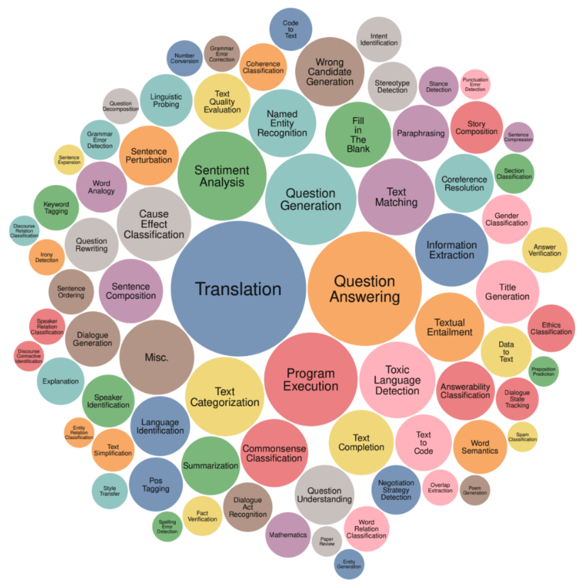

## From Large Language Models to Foundation Models

While language models are capable of incredible tasks, they are limited to text. As humans, we perceive the world not just via language but also through vision, hearing, touch, and more. Being able to process data beyond text is essential for AI to operate in the real world.

For this reason, language models are being extended to incorporate more data modalities. GPT-4V and Claude 3 can understand images and texts. Some models even understand videos, 3D assets, protein structures, and so on. Incorporating more data modalities into language models makes them even more powerful. OpenAI  [noted in their GPT-4V system card](https://oreil.ly/NoGX7)  in 2023 that “incorporating additional modalities (such as image inputs) into LLMs is viewed by some as a key frontier in AI research and development.”

While many people still call Gemini and GPT-4V LLMs, they’re better characterized as [_foundation models_](https://arxiv.org/abs/2108.07258). The word _foundation_ signifies both the importance of these models in AI applications and the fact that they can be built upon for different needs.

Foundation models mark a breakthrough from the traditional structure of AI research. For a long time, AI research was divided by data modalities. Natural language processing (NLP) deals only with text. Computer vision deals only with vision. Text-only models can be used for tasks such as translation and spam detection. Image-only models can be used for object detection and image classification. Audio-only models can handle speech recognition (speech-to-text, or STT) and speech synthesis (text-to-speech, or TTS).

A model that can work with more than one data modality is also called a _multimodal model._ A generative multimodal model is also called a large multimodal model (LMM). If a language model generates the next token conditioned on text-only tokens, a multimodal model generates the next token conditioned on both text and image tokens, or whichever modalities that the model supports.

Just like language models, multimodal models need data to scale up. Self-supervision works for multimodal models too. For example, OpenAI used a variant of self-supervision called _natural language supervision_ to train their language-image model [CLIP (OpenAI, 2021)](https://oreil.ly/zcqdu). Instead of manually generating labels for each image, they found (image, text) pairs that co-occurred on the internet. They were able to generate a dataset of 400 million (image, text) pairs, which was 400 times larger than ImageNet, without manual labeling cost. This dataset enabled CLIP to become the first model that could generalize to multiple image classification tasks without requiring additional training.

Foundation models also mark the transition from task-specific models to general-purpose models. Previously, models were often developed for specific tasks, such as sentiment analysis or translation. A model trained for sentiment analysis wouldn’t be able to do translation, and vice versa.

_Foundation models, thanks to their scale and the way they are trained, are capable of a wide range of tasks._ Out of the box, general-purpose models can work relatively well for many tasks. An LLM can do both sentiment analysis and translation. However, you can often tweak a general-purpose model to maximize its performance on a specific task.

[tasks benchmark](../images/tasks-benchmark.jpg) shows the tasks used by the Super-NaturalInstructions benchmark to evaluate foundation models ([Wang et al., 2022](https://arxiv.org/abs/2204.07705)), providing an idea of the types of tasks a foundation model can perform.

There are multiple techniques you can use to get the model to generate  what you want. For example, you can craft detailed instructions with examples of the desirable product descriptions. This approach is  _prompt engineering_.  You can connect the model to a database of customer reviews that the model can leverage to generate better descriptions. Using a database to supplement the instructions is called _retrieval-augmented generation_ (RAG).  You can also _finetune_—further train—the model on a dataset of high-quality product descriptions.

Prompt engineering, RAG, and finetuning are three very common AI engineering techniques that you can use to adapt a model to your needs. 