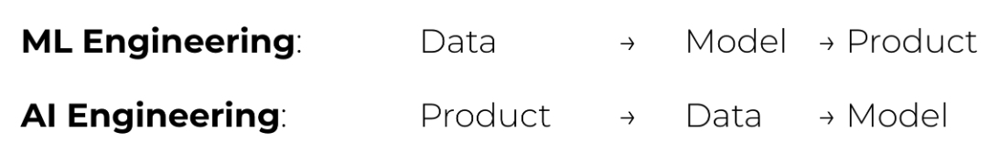

## AI Engineering Versus Full-Stack Engineering

The increased emphasis on application development, especially on interfaces, brings AI engineering closer to full-stack development.[27](https://learning.oreilly.com/library/view/ai-engineering/9781098166298/ch01.html#id675) The rising importance of interfaces leads to a shift in the design of AI toolings to attract more frontend engineers. Traditionally, ML engineering is Python-centric. Before foundation models, the most popular ML frameworks supported mostly Python APIs. Today, Python is still popular, but there is also increasing support for JavaScript APIs, with [LangChain.js](https://github.com/langchain-ai/langchainjs), [Transformers.js](https://github.com/huggingface/transformers.js), [OpenAI’s Node library](https://github.com/openai/openai-node), and [Vercel’s AI SDK](https://github.com/vercel/ai).

While many AI engineers come from traditional ML backgrounds, more are increasingly coming from web development or full-stack backgrounds. An advantage that full-stack engineers have over traditional ML engineers is their ability to quickly turn ideas into demos, get feedback, and iterate.

With traditional ML engineering, you usually start with gathering data and training a model. Building the product comes last. However, with AI models readily available today, it’s possible to start with building the product first, and only invest in data and models once the product shows promise, as visualized in  [Figure 1](../images/new-ai-engineering-workflow.jpg).

In traditional ML engineering, model development and product development are often disjointed processes, with ML engineers rarely involved in product decisions at many organizations. However, with foundation models, AI engineers tend to be much more involved in building the product.