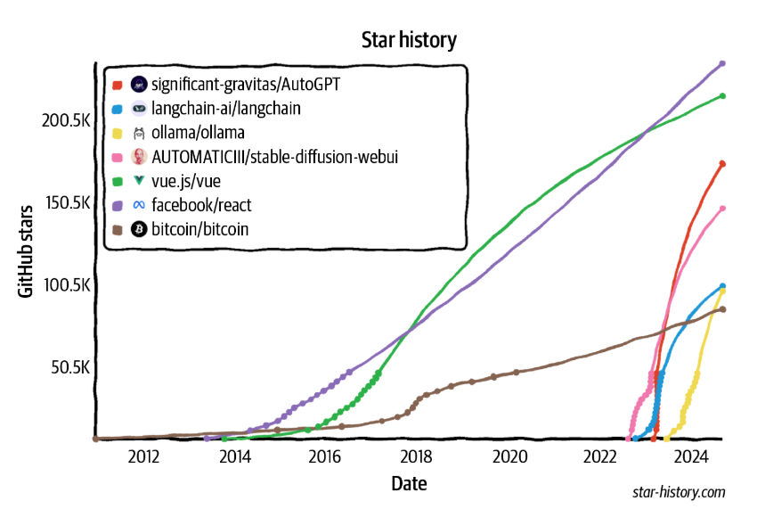

## From Foundation Models to AI Engineering

_AI engineering_  refers to the process of building applications on top of foundation models. People have been building AI applications for over a decade—a process often known as ML engineering or MLOps (short for ML operations). Why do we talk about AI engineering now?

If traditional ML engineering involves developing ML models, AI engineering leverages existing ones. The availability and accessibility of powerful foundation models lead to three factors that, together, create ideal conditions for the rapid growth of AI engineering as a discipline:

Factor 1: General-purpose AI capabilities

Foundation models are powerful not just because they can do existing tasks better. They are also powerful because they can do more tasks. Applications previously thought impossible are now possible, and applications not thought of before are emerging. Even applications not thought possible today might be possible tomorrow. This makes AI more useful for more aspects of life, vastly increasing both the user base and the demand for AI applications.

Factor 2: Increased AI investments

The success of ChatGPT prompted a sharp increase in investments in AI, both from venture capitalists and enterprises. As AI applications become cheaper to build and faster to go to market, returns on investment for AI become more attractive. Companies rush to incorporate AI into their products and processes. Matt Ross, a senior manager of applied research at Scribd, told me that the estimated AI cost for his use cases has gone down two orders of magnitude from April 2022 to April 2023.

Factor 3: Low entrance barrier to building AI applications

The model as a service approach popularized by OpenAI and other model providers makes it easier to leverage AI to build applications. In this approach, models are exposed via APIs that receive user queries and return model outputs. Without these APIs, using an AI model requires the infrastructure to host and serve this model. These APIs give you access to powerful models via single API calls.

Not only that, AI also makes it possible to build applications with minimal coding. First, AI can write code for you, allowing people without a software engineering background to quickly turn their ideas into code and put them in front of their users. Second, you can work with these models in plain English instead of having to use a programming language. _Anyone, and I mean anyone, can now develop AI applications._

Because of the resources it takes to develop foundation models, this process is possible only for big corporations (Google, Meta, Microsoft, Baidu, Tencent), governments ([Japan](https://oreil.ly/r86Qz), the  [UAE](https://oreil.ly/IUcVg)), and ambitious, well-funded startups (OpenAI, Anthropic, Mistral). In a September 2022 interview,  [Sam Altman, CEO of OpenAI](https://oreil.ly/D9QBM), said that the biggest opportunity for the vast majority of people will be to adapt these models for specific applications.

The world is quick to embrace this opportunity. AI engineering has rapidly emerged as one of the fastest, and quite possibly the fastest-growing, engineering discipline. Tools for AI engineering are gaining traction faster than any previous software engineering tools. Within just two years, four open source AI engineering tools (AutoGPT, Stable Diffusion eb UI, LangChain, Ollama) have already garnered more stars on GitHub than Bitcoin. They are on track to surpass even the most popular web development frameworks, including React and Vue, in star count. [Figure 1](../chapter-1/open-source-ai-engineering-tools.jpg)  shows the GitHub star growth of AI engineering tools compared to Bitcoin, Vue, and React.

