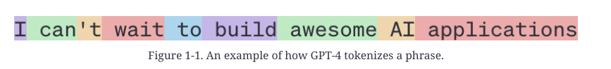

# Chapter 1. Introduction to Building AI Applications with Foundation Models

> The scaling up of AI models has two major consequences. First, AI
 models are becoming more powerful and capable of more tasks, enabling
 more applications. More people and teams leverage AI to increase
 productivity, create economic value, and improve quality of life.

> In short, the demand for AI applications has increased while the barrier to entry for building AI applications has decreased. This has turned _AI engineering_—the process of building applications on top of readily available models—into one of the fastest-growing engineering disciplines.

# The Rise of AI Engineering

Foundation models emerged from large language models, which, in turn, originated as just language models.  While applications like ChatGPT and GitHub’s Copilot may seem to have come out of nowhere, they are the culmination of decades of technology advancements, with the first language models emerging in the 1950s. 

### Language models

A _language model_ encodes statistical information about one or more languages. Intuitively, this information tells us how likely a word is to appear in a given context. For example, given the context “My favorite color is __”, a language model that encodes English should predict “blue” more often than “car”.

The basic unit of a language model is _token_. A token can be a character, a word, or a part of a word (like -tion), depending on the model.

For example, GPT-4, a model behind ChatGPT, breaks the phrase “I can’t wait to build AI applications” into nine tokens, as shown in [Figure 1-1](../chapter-1/tokenizes.jpg). Note that in this example, the word “can’t” is broken into two tokens, _can_ and _’t_. You can see how different OpenAI models tokenize text on the [OpenAI website](https://oreil.ly/0QI91).

###### Note

Why do language models use  _token_  as their unit instead of  _word_  or  _character_? There are three main reasons:

1.  Compared to characters, tokens allow the model to break words into meaningful components. For example, “cooking” can be broken into “cook” and “ing”, with both components carrying some meaning of the original word.
    
2.  Because there are fewer unique tokens than unique words, this reduces the model’s vocabulary size, making the model more efficient (as discussed in  [Chapter 2](https://learning.oreilly.com/library/view/ai-engineering/9781098166298/ch02.html#ch02_understanding_foundation_models_1730147895571359)).
    
3.  Tokens also help the model process unknown words. For instance, a made-up word like “chatgpting” could be split into “chatgpt” and “ing”, helping the model understand its structure. Tokens balance having fewer units than words while retaining more meaning than individual characters.