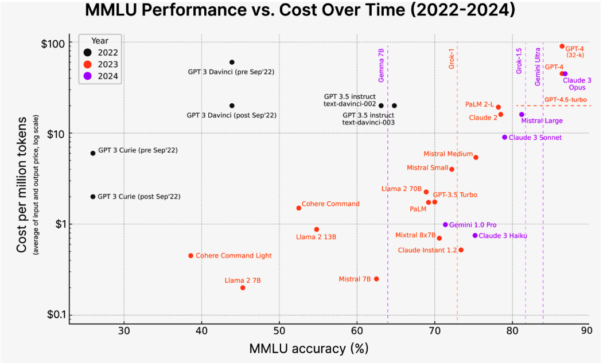

# Planning AI Applications

Given the seemingly limitless potential of AI, it’s tempting to jump into building applications. If you just want to learn and have fun, jump right in. Building is one of the best ways to learn. In the early days of foundation models, several heads of AI told me that they encouraged their teams to experiment with AI applications to upskill themselves.

However, if you’re doing this for a living, it might be worthwhile to take a step back and consider why you’re building this and how you should go about it. It’s easy to build a cool demo with foundation models. It’s hard to create a profitable product.

## Use Case Evaluation

The first question to ask is why you want to build this application. Like many business decisions, building an AI application is often a response to risks and opportunities. Here are a few examples of different levels of risks, ordered from high to low:

1.  _If you don’t do this, competitors with AI can make you obsolete._ If AI poses a major existential threat to your business, incorporating AI must have the highest priority. In the 2023 [Gartner study](https://oreil.ly/gqi3d), 7% cited business continuity as their reason for embracing AI. This is more common for businesses involving document processing and information aggregation, such as financial analysis, insurance, and data processing. This is also common for creative work such as advertising, web design, and image production. You can refer to the 2023 OpenAI study, “GPTs are GPTs” ([Eloundou et al., 2023](https://arxiv.org/abs/2303.10130)), to see how industries rank in their exposure to AI.
    
2.  _If you don’t do this, you’ll miss opportunities to boost profits and productivity._ Most companies embrace AI for the opportunities it brings. AI can help in most, if not all, business operations. AI can make user acquisition cheaper by crafting more effective copywrites, product descriptions, and promotional visual content. AI can increase user retention by improving customer support and customizing user experience. AI can also help with sales lead generation, internal communication, market research, and competitor tracking.
    
3.  _You’re unsure where AI will fit into your business yet, but you don’t want to be left behind._ While a company shouldn’t chase every hype train, many have failed by waiting too long to take the leap (cue Kodak, Blockbuster, and BlackBerry). Investing resources into understanding how a new, transformational technology can impact your business isn’t a bad idea if you can afford it. At bigger companies, this can be part of the R&D department.[19](https://learning.oreilly.com/library/view/ai-engineering/9781098166298/ch01.html#id599)
    

Once you’ve found a good reason to develop this use case, you might consider whether you have to build it yourself. If AI poses an existential threat to your business, you might want to do AI in-house instead of outsourcing it to a competitor. However, if you’re using AI to boost profits and productivity, you might have plenty of buy options that can save you time and money while giving you better performance.

### The role of AI and humans in the application

What role AI plays in the AI product influences the application’s development and its requirements. [Apple](https://oreil.ly/Dz1HE) has a great document explaining different ways AI can be used in a product. Here are three key points relevant to the current discussion:

Critical or complementary

If an app can still work without AI, AI is complementary to the app. For example, Face ID wouldn’t work without AI-powered facial recognition, whereas Gmail would still work without Smart Compose.

The more critical AI is to the application, the more accurate and reliable the AI part has to be. People are more accepting of mistakes when AI isn’t core to the application.

Reactive or proactive

A reactive feature shows its responses in reaction to users’ requests or specific actions, whereas a proactive feature shows its responses when there’s an opportunity for it. For example, a chatbot is reactive, whereas traffic alerts on Google Maps are proactive.

Because reactive features are generated in response to events, they usually, but not always, need to happen fast. On the other hand, proactive features can be precomputed and shown opportunistically, so latency is less important.

Because users don’t ask for proactive features, they can view them as intrusive or annoying if the quality is low. Therefore, proactive predictions and generations typically have a higher quality bar.

Dynamic or static

Dynamic features are updated continually with user feedback, whereas static features are updated periodically. For example, Face ID needs to be updated as people’s faces change over time. However, object detection in Google Photos is likely updated only when Google Photos is upgraded.

In the case of AI, dynamic features might mean that each user has their own model, continually finetuned on their data, or other mechanisms for personalization such as ChatGPT’s memory feature, which allows ChatGPT to remember each user’s preferences. However, static features might have one model for a group of users. If that’s the case, these features are updated only when the shared model is updated.

It’s also important to clarify the role of humans in the application. Will AI provide background support to humans, make decisions directly, or both? For example, for a customer support chatbot, AI responses can be used in different ways:

-   AI shows several responses that human agents can reference to write faster responses.
    
-   AI responds only to simple requests and routes more complex requests to humans.
    
-   AI responds to all requests directly, without human involvement.
    

Involving humans in AI’s decision-making processes is called  _human-in-the-loop_.

Microsoft (2023) proposed a framework for gradually increasing AI automation in products that they call [Crawl-Walk-Run](https://oreil.ly/JW4_A):

1.  Crawl means human involvement is mandatory.
    
2.  Walk means AI can directly interact with internal employees.
    
3.  Run means increased automation, potentially including direct AI interactions with external users.
    

The role of humans can change over time as the quality of the AI system improves. For example, in the beginning, when you’re still evaluating AI capabilities, you might use it to generate suggestions for human agents. If the acceptance rate by human agents is high, for example, 95% of AI-suggested responses to simple requests are used by human agents verbatim, you can let customers interact with AI directly for those simple requests.

### AI product defensibility

If you’re selling AI applications as standalone products, it’s important to consider their defensibility. The low entry barrier is both a blessing and a curse. If something is easy for you to build, it’s also easy for your competitors. What moats do you have to defend your product?

In a way, building applications on top of foundation models means providing a layer on top of these models.[20](https://learning.oreilly.com/library/view/ai-engineering/9781098166298/ch01.html#id607) This also means that if the underlying models expand in capabilities, the layer you provide might be subsumed by the models, rendering your application obsolete. Imagine building a PDF-parsing application on top of ChatGPT based on the assumption that ChatGPT can’t parse PDFs well or can’t do so at scale. Your ability to compete will weaken if this assumption is no longer true. However, even in this case, a PDF-parsing application might still make sense if it’s built on top of open source models, gearing your solution toward users who want to host models in-house.

One general partner at a major VC firm told me that she’s seen many startups whose entire products could be a feature for Google Docs or Microsoft Office. If their products take off, what would stop Google or Microsoft from allocating three engineers to replicate these products in two weeks?

In AI, there are generally three types of competitive advantages: technology, data, and distribution—the ability to bring your product in front of users. With foundation models, the core technologies of most companies will be similar. The distribution advantage likely belongs to big companies.

The data advantage is more nuanced. Big companies likely have more existing data. However, if a startup can get to market first and gather sufficient usage data to continually improve their products, data will be their moat. Even for the scenarios where user data can’t be used to train models directly, usage information can give invaluable insights into user behaviors and product shortcomings, which can be used to guide the data collection and training process.[21](https://learning.oreilly.com/library/view/ai-engineering/9781098166298/ch01.html#id608)

There have been many successful companies whose original products could’ve been features of larger products. Calendly could’ve been a feature of Google Calendar. Mailchimp could’ve been a feature of Gmail. Photoroom could’ve been a feature of Google Photos.[22](https://learning.oreilly.com/library/view/ai-engineering/9781098166298/ch01.html#id609) Many startups eventually overtake bigger competitors, starting by building a feature that these bigger competitors overlooked. Perhaps yours can be the next one.

## Setting Expectations

Once you’ve decided that you need to build this amazing AI application by yourself, the next step is to figure out what success looks like: how will you measure success? The most important metric is how this will impact your business. For example, if it’s a customer support chatbot, the business metrics can include the following:

-   What percentage of customer messages do you want the chatbot to automate?
    
-   How many more messages should the chatbot allow you to process?
    
-   How much quicker can you respond using the chatbot?
    
-   How much human labor can the chatbot save you?
    

A chatbot can answer more messages, but that doesn’t mean it’ll make users happy, so it’s important to track customer satisfaction and customer feedback in general. [“User Feedback”](https://learning.oreilly.com/library/view/ai-engineering/9781098166298/ch10.html#ch10_user_feedback_1730130985313500) discusses how to design a feedback system.

To ensure a product isn’t put in front of customers before it’s ready, have clear expectations on its usefulness threshold: how good it has to be for it to be useful. Usefulness thresholds might include the following metrics groups:

-   Quality metrics to measure the quality of the chatbot’s responses.
    
-   Latency metrics including TTFT (time to first token), TPOT (time per output token), and total latency. What is considered acceptable latency depends on your use case. If all of your customer requests are currently being processed by humans with a median response time of an hour, anything faster than this might be good enough.
    
-   Cost metrics: how much it costs per inference request.
    
-   Other metrics such as interpretability and fairness.
    

If you’re not yet sure what metrics you want to use, don’t worry. The rest of the book will cover many of these metrics.

## Milestone Planning

Once you’ve set measurable goals, you need a plan to achieve these goals. How to get to the goals depends on where you start. Evaluate existing models to understand their capabilities. The stronger the off-the-shelf models, the less work you’ll have to do. For example, if your goal is to automate 60% of customer support tickets and the off-the-shelf model you want to use can already automate 30% of the tickets, the effort you need to put in might be less than if it can automate no tickets at all.

It’s likely that your goals will change after evaluation. For example, after evaluation, you may realize that the resources needed to get the app to the usefulness threshold will be more than its potential return, and, therefore, you no longer want to pursue it.

Planning an AI product needs to account for its last mile challenge. Initial success with foundation models can be misleading. As the base capabilities of foundation models are already quite impressive, it might not take much time to build a fun demo. However, a good initial demo doesn’t promise a good end product. It might take a weekend to build a demo but months, and even years, to build a product.

In the paper UltraChat,  [Ding et al. (2023)](https://arxiv.org/abs/2305.14233)  shared that “the journey from 0 to 60 is easy, whereas progressing from 60 to 100 becomes exceedingly challenging.”  [LinkedIn (2024)](https://www.linkedin.com/blog/engineering/generative-ai/musings-on-building-a-generative-ai-product)  shared the same sentiment. It took them one month to achieve 80% of the experience they wanted. This initial success made them grossly underestimate how much time it’d take them to improve the product. They found it took them four more months to finally surpass 95%. A lot of time was spent working on the product kinks and dealing with hallucinations. The slow speed of achieving each subsequent 1% gain was discouraging.

## Maintenance

Product planning doesn’t stop at achieving its goals. You need to think about how this product might change over time and how it should be maintained.  Maintenance of an AI product has the added challenge of AI’s fast pace of change. The AI space has been moving incredibly fast in the last decade. It’ll probably continue moving fast for the next decade. Building on top of foundation models today means committing to riding this bullet train.

Many changes are good. For example, the limitations of many models are being addressed. Context lengths are getting longer. Model outputs are getting better. Model _inference_, the process of computing an output given an input, is getting faster and cheaper. [Figure 1](../chapter-1/mmlu-accuracy.jpg) shows the evolution of inference cost and model performance on Massive Multitask Language Understanding (MMLU) ([Hendrycks et al., 2020](https://arxiv.org/abs/2009.03300)), a popular foundation model benchmark, between 2022 and 2024.

However, even these good changes can cause friction in your workflows. You’ll have to constantly be on your guard and run a cost-benefit analysis of each technology investment. The best option today might turn into the worst option tomorrow. You may decide to build a model in-house because it seems cheaper than paying for model providers, only to find out after three months that model providers have dropped their prices in half, making in-house the expensive option. You might invest in a third-party solution and tailor your infrastructure around it, only for the provider to go out of business after failing to secure funding.

Some changes are easier to adapt to. For example, as model providers converge to the same API, it’s becoming easier to swap one model API for another. However, as each model has its quirks, strengths, and weaknesses, developers working with the new model will need to adjust their workflows, prompts, and data to this new model. Without proper infrastructure for versioning and evaluation in place, the process can cause a lot of headaches.

Some changes are harder to adapt to, especially those around regulations. Technologies surrounding AI are considered national security issues for many countries, meaning resources for AI, including compute, talent, and data, are heavily regulated. The introduction of Europe’s General Data Protection Regulation (GDPR), for example, was estimated to cost businesses  [$9 billion](https://oreil.ly/eDfB8)  to become compliant. Compute availability can change overnight as new laws put more restrictions on who can buy and sell compute resources (see the  [US October 2023 Executive Order](https://oreil.ly/eYTmr)). If your GPU vendor is suddenly banned from selling GPUs to your country, you’re in trouble.

Some changes can even be fatal. For example, regulations around intellectual property (IP) and AI usage are still evolving. If you build your product on top of a model trained using other people’s data, can you be certain that your product’s IP will always belong to you? Many IP-heavy companies I’ve talked to, such as game studios, hesitate to use AI for fear of losing their IPs later on.