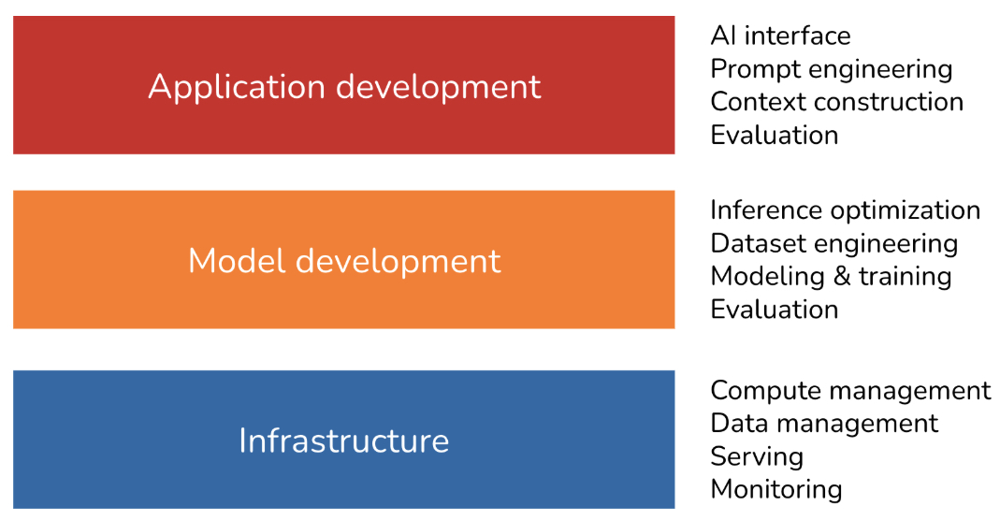
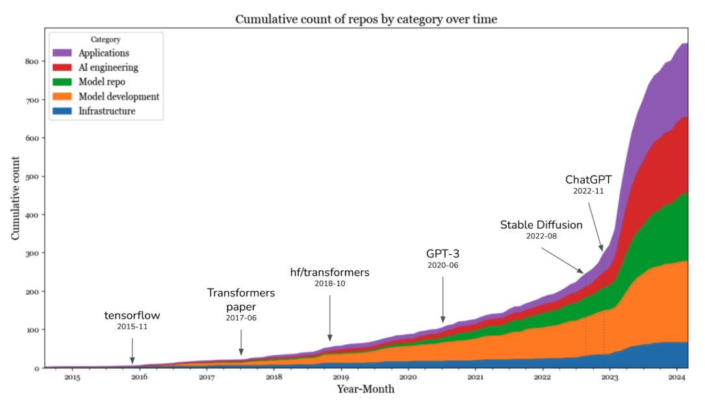

# The AI Engineering Stack

AI engineering’s rapid growth also induced an incredible amount of hype and FOMO (fear of missing out). The number of new tools, techniques, models, and applications introduced every day can be overwhelming. Instead of trying to keep up with the constantly shifting sand, let’s look into the fundamental building blocks of AI engineering.

## Three Layers of the AI Stack

There are three layers to any AI application stack: application development, model development, and infrastructure. When developing an AI application, you’ll likely start from the top layer and move down as needed:

Application development

With models readily available, anyone can use them to develop applications. This is the layer that has seen the most action in the last two years, and it is still rapidly evolving. Application development involves providing a model with good prompts and necessary context. This layer requires rigorous evaluation. Good applications also demand good interfaces.

Model development

This layer provides tooling for developing models, including frameworks for modeling, training, finetuning, and inference optimization. Because data is central to model development, this layer also contains dataset engineering. Model development also requires rigorous evaluation.

Infrastructure

At the bottom is the stack is infrastructure, which includes tooling for model serving, managing data and compute, and monitoring.

These three layers and examples of responsibilities for each layer are shown in [Figure 1](../chapter-1/three-layers.jpg).

To get a sense of how the landscape has evolved with foundation models, in March 2024, I searched GitHub for all AI-related repositories with at least 500 stars. Given the prevalence of GitHub, I believe this data is a good proxy for understanding the ecosystem. In my analysis, I also included repositories for applications and models, which are the products of the application development and model development layers, respectively. I found a total of 920 repositories. [Figure 2](../chapter-1/count-repos.jpg) shows the cumulative number of repositories in each category month-over-month.

The data shows a big jump in the number of AI toolings in 2023, after the introduction of Stable Diffusion and ChatGPT. In 2023, the categories that saw the highest increases were applications and application development. The infrastructure layer saw some growth, but it was much less than the growth seen in other layers. This is expected. Even though models and applications have changed, the core infrastructural needs—resource management, serving, monitoring, etc.—remain the same.

This brings us to the next point. While the level of excitement and creativity around foundation models is unprecedented, many principles of building AI applications remain the same. For enterprise use cases, AI applications still need to solve business problems, and, therefore, it’s still essential to map from business metrics to ML metrics and vice versa. You still need to do systematic experimentation. With classical ML engineering, you experiment with different hyperparameters. With foundation models, you experiment with different models, prompts, retrieval algorithms, sampling variables, and more. (Sampling variables are discussed in  [Chapter 2](https://learning.oreilly.com/library/view/ai-engineering/9781098166298/ch02.html#ch02_understanding_foundation_models_1730147895571359).) We still want to make models run faster and cheaper. It’s still important to set up a feedback loop so that we can iteratively improve our applications with production data.

This means that much of what ML engineers have learned and shared over the last decade is still applicable. This collective experience makes it easier for everyone to begin building AI applications. However, built on top of these enduring principles are many innovations unique to AI engineering
