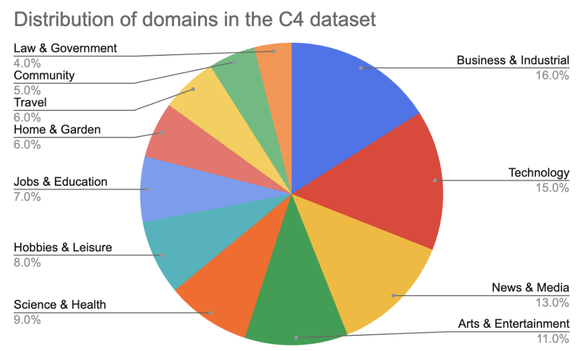

## Domain-Specific Models

General-purpose models like [Gemini](https://oreil.ly/4XsOV), [GPTs](https://oreil.ly/KLVgX), and [Llamas](https://oreil.ly/58gxQ) can perform incredibly well on a wide range of domains, including but not limited to coding, law, science, business, sports, and environmental science. This is largely thanks to the inclusion of these domains in their training data. [Figure 1](../images/distribution-domain-specific-models.jpg) shows the distribution of domains present in Common Crawl according to the _Washington Post_’s 2023 analysis.[3](https://learning.oreilly.com/library/view/ai-engineering/9781098166298/ch02.html#id705)

Even though general-purpose foundation models can answer everyday questions about different domains, they are unlikely to perform well on domain-specific tasks, especially if they never saw these tasks during training. Two examples of domain-specific tasks are drug discovery and cancer screening. Drug discovery involves protein, DNA, and RNA data, which follow specific formats and are expensive to acquire. This data is unlikely to be found in publicly available internet data. Similarly, cancer screening typically involves X-ray and fMRI (functional magnetic resonance imaging) scans, which are hard to obtain due to privacy.

To train a model to perform well on these domain-specific tasks, you might need to curate very specific datasets. One of the most famous domain-specific models is perhaps [DeepMind’s AlphaFold](https://oreil.ly/JX37g), trained on the sequences and 3D structures of around 100,000 known proteins. [NVIDIA’s BioNeMo](https://oreil.ly/M1Nsc) is another model that focuses on biomolecular data for drug discovery. [Google’s Med-PaLM2](https://oreil.ly/F76hq) combined the power of an LLM with medical data to answer medical queries with higher accuracy.