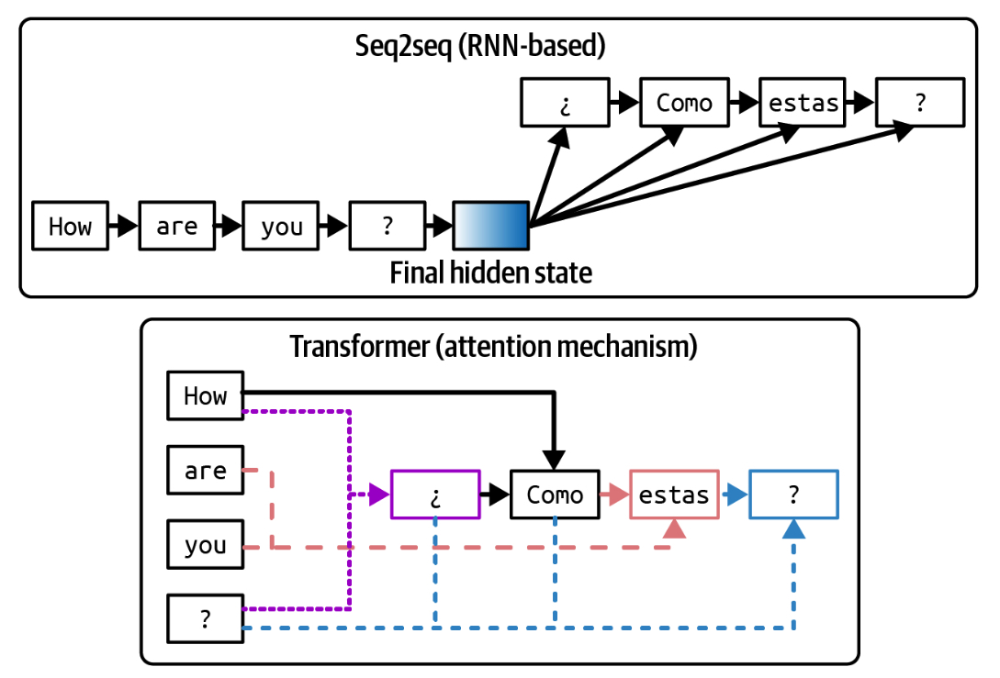

# Modeling

Before training a model, developers need to decide what the model should look like. What architecture should it follow? How many parameters should it have? These decisions impact not only the model’s capabilities but also its usability for downstream applications.[5](https://learning.oreilly.com/library/view/ai-engineering/9781098166298/ch02.html#id715) For example, a 7B-parameter model will be vastly easier to deploy than a 175B-parameter model. Similarly, optimizing a transformer model for latency is very different from optimizing another architecture. Let’s explore the factors behind these decisions.

## Model Architecture

As of this writing, the most dominant architecture for language-based foundation models is the _transformer_ architecture ([Vaswani et al., 2017](https://arxiv.org/abs/1706.03762)), which is based on the attention mechanism. It addresses many limitations of the previous architectures, which contributed to its popularity. However, the transformer architecture has its own limitations. This section analyzes the transformer architecture and its alternatives. Because it goes into the technical details of different architectures, it can be technically dense. If you find any part too deep in the weeds, feel free to skip it.

### Transformer architecture

To understand the transformer, let’s look at the problem it was created to solve.  The transformer architecture was popularized on the heels of the success of the [seq2seq (sequence-to-sequence) architecture](https://arxiv.org/abs/1409.3215).  At the time of its introduction in 2014, seq2seq provided significant improvement on then-challenging tasks: machine translation and summarization. In 2016,  [Google incorporated seq2seq into Google Translate](https://oreil.ly/fb1aR), an update that they claimed to have given them the “largest improvements to date for machine translation quality”. This generated a lot of interest in seq2seq, making it the go-to architecture for tasks involving sequences of text.

At a high level, seq2seq contains an encoder that processes inputs and a decoder that generates outputs. Both inputs and outputs are sequences of tokens, hence the name.  Seq2seq uses RNNs (recurrent neural networks) as its encoder and decoder. In its most basic form, the encoder processes the input tokens sequentially, outputting the final hidden state that represents the input. The decoder then generates output tokens sequentially, conditioned on both the final hidden state of the input and the previously generated token. A visualization of the seq2seq architecture is shown in the top half of  [Figure 1](../images/seq2seq2-vs-transformer-architecture.jpg).

.

> *Seq2seq architecture versus transformer architecture. For the transformer architecture, the arrows show the tokens that the decoder attends to when generating each output token.*

There are two problems with seq2seq that Vaswani et al. (2017) addresses. First, the vanilla seq2seq decoder generates output tokens using only the final hidden state of the input. Intuitively, this is like generating answers about a book using the book summary. This limits the quality of the generated outputs. Second, the RNN encoder and decoder mean that both input processing and output generation are done sequentially, making it slow for long sequences. If an input is 200 tokens long, seq2seq has to wait for each input token to finish processing before moving on to the next.[6](https://learning.oreilly.com/library/view/ai-engineering/9781098166298/ch02.html#id719)

The transformer architecture addresses both problems with the attention mechanism. The attention mechanism allows the model to weigh the importance of different input tokens when generating each output token. This is like generating answers by referencing any page in the book.

The transformer architecture dispenses with  RNNs  entirely. With transformers, the input tokens can be processed in parallel, significantly speeding up input processing. While the transformer removes the sequential input bottleneck, transformer-based autoregressive language models still have the sequential output bottleneck.

Inference for transformer-based language models, therefore, consists of two steps:

Prefill

The model processes the input tokens in parallel. This step creates the intermediate state necessary to generate the first output token. This intermediate state includes the key and value vectors for all input tokens.

Decode

The model generates one output token at a time.

As explored later in  [Chapter 9](https://learning.oreilly.com/library/view/ai-engineering/9781098166298/ch09.html#ch09_inference_optimization_1730130963006301), the parallelizable nature of prefilling and the sequential aspect of decoding both motivate many optimization techniques to make language model inference cheaper and faster.