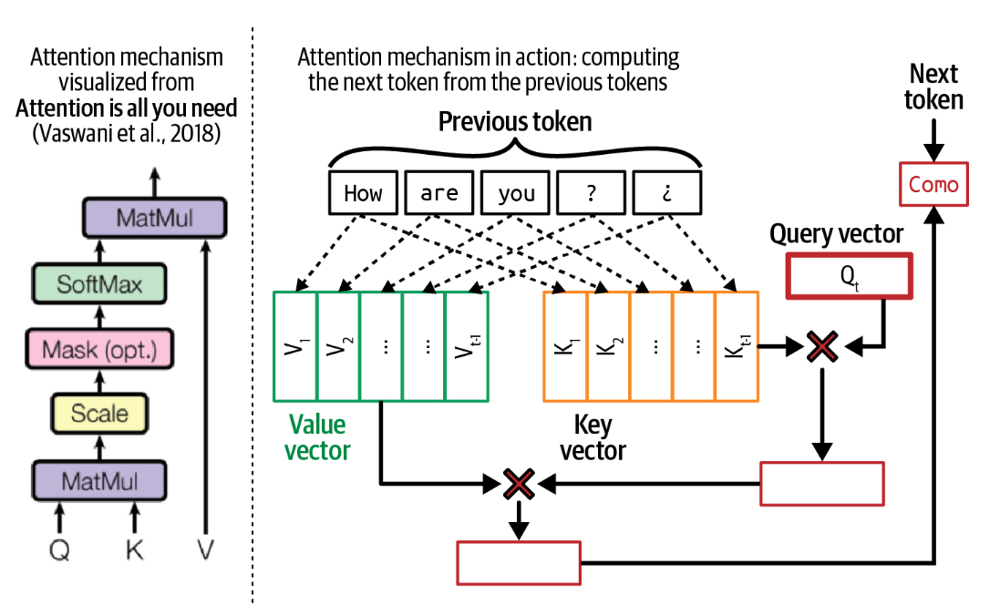

#### Attention mechanism

At the heart of the transformer architecture is the attention mechanism. Understanding this mechanism is necessary to understand how transformer models work. Under the hood, the attention mechanism leverages key, value, and query vectors:

-   The query vector (Q) represents the current state of the decoder at each decoding step. Using the same book summary example, this query vector can be thought of as the person looking for information to create a summary.
    
-   Each key vector (K) represents a previous token. If each previous token is a page in the book,  each key vector is like the page number. Note that at a given decoding step, previous tokens include both input tokens and previously generated tokens.
    
-   Each value vector (V) represents the actual value of a previous token, as learned by the model. Each value vector is like the page’s content.
    

The attention mechanism computes how much attention to give an input token by performing a  [_dot product_](https://en.wikipedia.org/wiki/Dot_product)  between the query vector and its key vector. A high score means that the model will use more of that page’s content (its value vector) when generating the book’s summary. A visualization of the attention mechanism with the key, value, and query vectors is shown in  [Figure 1](../images/attention-mechanism.jpg). In this visualization, the query vector is seeking information from the previous tokens  `How, are, you, ?, ¿`  to generate the next token.

###### An example of the attention mechanism in action next to its high-level visualization from the famous transformer paper, “Attention Is All You Need” (Vaswani et al., 2017).

Because each previous token has a corresponding key and value vector, the longer the sequence, the more key and value vectors need to be computed and stored. This is one reason why it’s so hard to extend context length for transformer models. How to efficiently compute and store key and value vectors comes up again in Chapters [7](https://learning.oreilly.com/library/view/ai-engineering/9781098166298/ch07.html#ch07) and [9](https://learning.oreilly.com/library/view/ai-engineering/9781098166298/ch09.html#ch09_inference_optimization_1730130963006301).

The attention mechanism is almost always multi-headed. Multiple heads allow the model to attend to different groups of previous tokens simultaneously. With multi-headed attention, the query, key, and value vectors are split into smaller vectors, each corresponding to an attention head. In the case of Llama 2-7B, because it has `32` attention heads, each `K`, `V`, and `Q` vector will be split into `32` vectors of the dimension `128`. This is because `4096 / 32 = 128`.

The outputs of all attention heads are then concatenated. An output projection matrix is used to apply another transformation to this concatenated output before it’s fed to the model’s next computation step. The output projection matrix has the same dimension as the model’s hidden dimension.