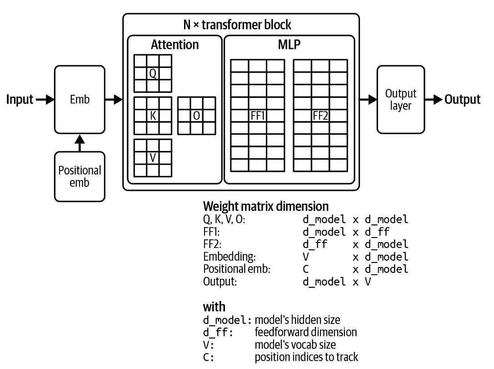
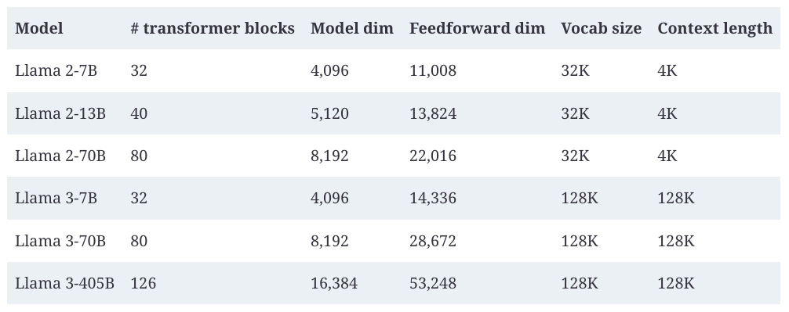

#### Attention mechanism

At the heart of the transformer architecture is the attention mechanism. Understanding this mechanism is necessary to understand how transformer models work. Under the hood, the attention mechanism leverages key, value, and query vectors:

-   The query vector (Q) represents the current state of the decoder at each decoding step. Using the same book summary example, this query vector can be thought of as the person looking for information to create a summary.
    
-   Each key vector (K) represents a previous token. If each previous token is a page in the book,  each key vector is like the page number. Note that at a given decoding step, previous tokens include both input tokens and previously generated tokens.
    
-   Each value vector (V) represents the actual value of a previous token, as learned by the model. Each value vector is like the page’s content.
    

The attention mechanism computes how much attention to give an input token by performing a  [_dot product_](https://en.wikipedia.org/wiki/Dot_product)  between the query vector and its key vector. A high score means that the model will use more of that page’s content (its value vector) when generating the book’s summary. A visualization of the attention mechanism with the key, value, and query vectors is shown in  [Figure 1](../images/attention-mechanism.jpg). In this visualization, the query vector is seeking information from the previous tokens  `How, are, you, ?, ¿`  to generate the next token.

###### An example of the attention mechanism in action next to its high-level visualization from the famous transformer paper, “Attention Is All You Need” (Vaswani et al., 2017).

Because each previous token has a corresponding key and value vector, the longer the sequence, the more key and value vectors need to be computed and stored. This is one reason why it’s so hard to extend context length for transformer models. How to efficiently compute and store key and value vectors comes up again in Chapters [7](https://learning.oreilly.com/library/view/ai-engineering/9781098166298/ch07.html#ch07) and [9](https://learning.oreilly.com/library/view/ai-engineering/9781098166298/ch09.html#ch09_inference_optimization_1730130963006301).

The attention mechanism is almost always multi-headed. Multiple heads allow the model to attend to different groups of previous tokens simultaneously. With multi-headed attention, the query, key, and value vectors are split into smaller vectors, each corresponding to an attention head. In the case of Llama 2-7B, because it has `32` attention heads, each `K`, `V`, and `Q` vector will be split into `32` vectors of the dimension `128`. This is because `4096 / 32 = 128`.

The outputs of all attention heads are then concatenated. An output projection matrix is used to apply another transformation to this concatenated output before it’s fed to the model’s next computation step. The output projection matrix has the same dimension as the model’s hidden dimension.

#### Transformer block

Now that we’ve discussed how attention works, let’s see how it’s used in a model. A transformer architecture is composed of multiple transformer blocks. The exact content of the block varies between models, but, in general, each transformer block contains the attention module and the MLP (multi-layer perceptron) module:

Attention module

Each attention module consists of four weight matrices: query, key, value, and output projection.

MLP module

An MLP module consists of linear layers separated by _nonlinear activation functions_. Each linear layer is a weight matrix that is used for linear transformations, whereas an activation function allows the linear layers to learn nonlinear patterns. A linear layer is also called a feedforward layer.

Common nonlinear functions are ReLU, Rectified Linear Unit ([Agarap, 2018](https://arxiv.org/abs/1803.08375)), and GELU ([Hendrycks and Gimpel, 2016](https://arxiv.org/abs/1606.08415)), which was used by GPT-2 and GPT-3, respectively. Action functions are very simple.[9](https://learning.oreilly.com/library/view/ai-engineering/9781098166298/ch02.html#id739) For example, all ReLU does is convert negative values to 0. Mathematically, it’s written as:

ReLU(x) = max(0, x)

The number of transformer blocks in a transformer model is often referred to as that model’s number of layers. A transformer-based language model is also outfitted with a module before and after all the transformer blocks:

An embedding module before the transformer blocks

This module consists of the embedding matrix and the positional embedding matrix, which convert tokens and their positions into embedding vectors, respectively. Naively, the number of position indices determines the model’s maximum context length. For example, if a model keeps track of 2,048 positions, its maximum context length is 2,048. However, there are techniques that increase a model’s context length without increasing the number of position indices.

An output layer after the transformer blocks

This module maps the model’s output vectors into token probabilities used to sample model outputs (discussed in  [“Sampling”](https://learning.oreilly.com/library/view/ai-engineering/9781098166298/ch02.html#ch02_sampling_1730147895572256)). This module typically consists of one matrix, which is also called the  _unembedding layer_. Some people refer to the output layer as the model  _head_, as it’s the model’s last layer before output generation.

[Figure 2](../images/transformer-block.jpg)  visualizes a transformer model architecture. The size of a transformer model is determined by the dimensions of its building blocks. Some of the key values are:

-   The model’s dimension determines the sizes of the key, query, value, and output projection matrices in the transformer block.
    
-   The number of transformer blocks.
    
-   The dimension of the feedforward layer.
    
-   The vocabulary size.

###### A visualization of the weight composition of a transformer model.

Larger dimension values result in larger model sizes. [Table 1](../images/dimension-values-different-llama-models.jpg) shows these dimension values for different Llama 2 ([Touvron et al., 2023](https://arxiv.org/abs/2307.09288)) and Llama 3 ([Dubey et al., 2024](https://arxiv.org/abs/2407.21783)) models. Note that while the increased context length impacts the model’s memory footprint, it doesn’t impact the model’s total number of parameters.

