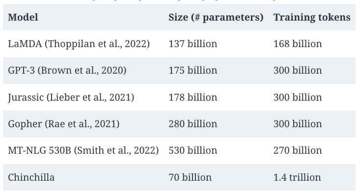

## Model Size

Much of AI progress in recent years can be attributed to increased model size. It’s hard to talk about foundation models without talking about their number of parameters. The number of parameters is usually appended at the end of a model name. For example, Llama-13B refers to the version of Llama, a model family developed by Meta, with 13 billion parameters.

In general, increasing a model’s parameters increases its capacity to learn, resulting in better models. Given two models of the same model family, the one with 13 billion parameters is likely to perform much better than the one with 7 billion parameters.
###### Note

> As the community better understands how to train large models, newer-generation models tend to outperform older-generation models of the same size. For example,  [Llama 3-8B (2024)](https://arxiv.org/abs/2407.21783)  outperforms even  [Llama 2-70B (2023)](https://arxiv.org/abs/2307.09288)  on the MMLU benchmark.

The number of parameters helps us estimate the compute resources needed to train and run this model. For example, if a model has 7 billion parameters, and each parameter is stored using 2 bytes (16 bits), then we can calculate that the GPU memory needed to do inference using this model will be at least 14 billion bytes (14 GB).[13](https://learning.oreilly.com/library/view/ai-engineering/9781098166298/ch02.html#id754)

The number of parameters can be misleading if the model is  _sparse_. A sparse model has a large percentage of zero-value parameters. A 7B-parameter model that is 90% sparse only has 700 million non-zero parameters. Sparsity allows for more efficient data storage and computation. This means that a large sparse model can require less compute than a small dense model.

A type of sparse model that has gained popularity in recent years is mixture-of-experts (MoE) ([Shazeer et al., 2017](https://arxiv.org/abs/1701.06538)). An MoE model is divided into different groups of parameters, and each group is an  _expert_. Only a subset of the experts is  _active_  for (used to) process each token.

For example,  [Mixtral 8x7B](https://oreil.ly/VvXbu)  is a mixture of eight experts, each expert with seven billion parameters. If no two experts share any parameter, it should have 8 × 7 billion = 56 billion parameters. However, due to some parameters being shared, it has only 46.7 billion parameters.

At each layer, for each token, only two experts are active. This means that only 12.9 billion parameters are active for each token. While this model has 46.7 billion parameters, its cost and speed are the same as a 12.9-billion-parameter model.

A larger model can also underperform a smaller model if it’s not trained on enough data. Imagine a 13B-param model trained on a dataset consisting of a single sentence: “I like pineapples.” This model will perform much worse than a much smaller model trained on more data.

When discussing model size, it’s important to consider the size of the data it was trained on. For most models, dataset sizes are measured by the number of training samples. For example, Google’s Flamingo ([Alayrac et al., 2022](https://arxiv.org/abs/2204.14198)) was trained using four datasets—one of them has 1.8 billion (image, text) pairs and one has 312 million (image, text) pairs.

For language models, a training sample can be a sentence, a Wikipedia page, a chat conversation, or a book. A book is worth a lot more than a sentence, so the number of training samples is no longer a good metric to measure dataset sizes. A better measurement is the number of tokens in the dataset.

The number of tokens isn’t a perfect measurement either, as different models can have different tokenization processes, resulting in the same dataset having different numbers of tokens for different models. Why not just use the number of words or the number of letters? Because a token is the unit that a model operates on, knowing the number of tokens in a dataset helps us measure how much a model can potentially learn from that data.

As of this writing, LLMs are trained using datasets in the order of trillions of tokens. Meta used increasingly larger datasets to train their Llama models:

-   1.4 trillion tokens for [Llama 1](https://arxiv.org/abs/2302.13971)
    
-   2 trillion tokens for [Llama 2](https://arxiv.org/abs/2307.09288)
    
-   15 trillion tokens for [Llama 3](https://oreil.ly/vfSQw)

_The number of tokens in a model’s dataset isn’t the same as its number of training tokens._ The number of training tokens measures the tokens that the model is trained on. If a dataset contains 1 trillion tokens and a model is trained on that dataset for two epochs—an _epoch_ is a pass through the dataset—the number of training tokens is 2 trillion.[15](https://learning.oreilly.com/library/view/ai-engineering/9781098166298/ch02.html#id760) See [Table 1](../images/number-of-training-tokens.jpg) for examples of the number of training tokens for models with different numbers of parameters.

###### Examples of the number of training tokens for models with different numbers of parameters. Source: “Training Compute-Optimal Large Language Models” ([DeepMind, 2022](https://oreil.ly/A3K90)).

Pre-training large models requires compute. One way to measure the amount of compute needed is by considering the number of machines, e.g., GPUs, CPUs, and TPUs. However, different machines have very different capacities and costs. An NVIDIA A10 GPU is different from an NVIDIA H100 GPU and an Intel Core Ultra Processor.

A more standardized unit for a model’s compute requirement is _FLOP_, or _floating point operation_. FLOP measures the number of floating point operations performed for a certain task.  Google’s largest PaLM-2 model, for example, was trained using  `10`22  FLOPs ([Chowdhery et al., 2022](https://arxiv.org/abs/2204.02311)). GPT-3-175B was trained using  `3.14 × 10`23  FLOPs ([Brown et al., 2020](https://arxiv.org/abs/2005.14165)).

_The plural form of FLOP, FLOPs, is often confused with FLOP/s, floating point operations per Second._  FLOPs measure the compute requirement for a task, whereas FLOP/s measures a machine’s peak performance. For example, an NVIDIA H100 NVL GPU can deliver a maximum of  [60 TeraFLOP/s](https://oreil.ly/HcFYz):  `6 × 10`13  FLOPs a second or  `5.2 × 10`18  FLOPs a day.[16](https://learning.oreilly.com/library/view/ai-engineering/9781098166298/ch02.html#id762)

###### Tip

> In summary, three numbers signal a model’s scale:
> 
> -   Number of parameters, which is a proxy for the model’s learning capacity.
>     
> -   Number of tokens a model was trained on, which is a proxy for how much a model learned.
>     
> -   Number of FLOPs, which is a proxy for the training cost.