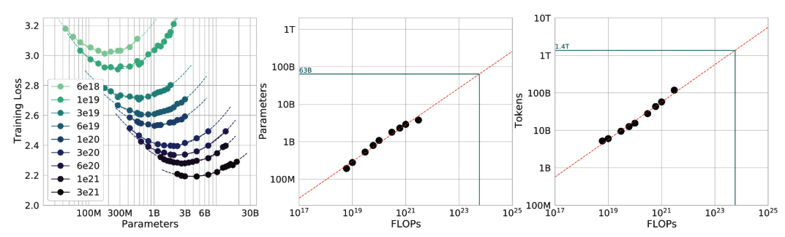
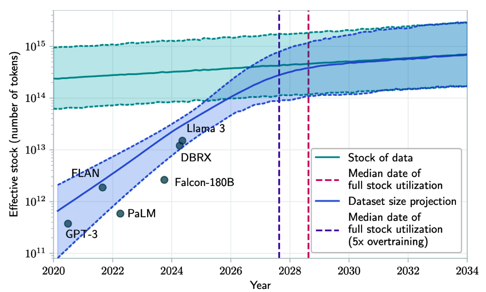

### Scaling law: Building compute-optimal models

I hope that the last section has convinced you of three things:

1.  Model performance depends on the model size and the dataset size.
    
2.  Bigger models and bigger datasets require more compute.
    
3.  Compute costs money.
    

Unless you have unlimited money, budgeting is essential. You don’t want to start with an arbitrarily large model size and see how much it would cost. You start with a budget—how much money you want to spend—and work out the best model performance you can afford. As compute is often the limiting factor—compute infrastructure is not only expensive but also hard to set up—teams often start with a compute budget. Given a fixed amount of  FLOPs, what model size and dataset size would give the best performance? A model that can achieve the best performance given a fixed compute budget is  _compute-optional_.

Given a compute budget, the rule that helps calculate the optimal model size and dataset size is called the Chinchilla  _scaling law_, proposed in the Chinchilla paper  [“Training Compute-Optimal Large Language Models”](https://arxiv.org/abs/2203.15556)  (DeepMind, 2022).  To study the relationship between model size, dataset size, compute budget, and model performance, the authors trained 400 language models ranging from 70 million to over 16 billion parameters on 5 to 500 billion tokens. They found that for compute-optimal training, you need the number of training tokens to be approximately 20 times the model size. This means that a 3B-parameter model needs approximately 60B training tokens. The model size and the number of training tokens should be scaled equally: for every doubling of the model size, the number of training tokens should also be doubled.

We’ve come a long way from when the training process was treated like alchemy.  [Figure 1](../images/training-loss.jpg)  shows that we can predict not only the optimal number of parameters and tokens for each FLOP budget but also the expected training loss from these settings (assuming we do things right).

This compute-optimal calculation assumes that the cost of acquiring data is much cheaper than the cost of compute. The same Chinchilla paper proposes another calculation for when the cost of training data is nontrivial.

###### Graphs that depict the relationships between training loss, a model’s number of parameters, FLOPs, and number of training tokens. Source: “Training Compute-Optional Large Language Models” (DeepMind, 2022).

The scaling law was developed for dense models trained on predominantly human-generated data. Adapting this calculation for sparse models, such as mixture-of-expert models, and synthetic data is an active research area.

The scaling law optimizes model quality given a compute budget. However, it’s important to remember that for production, model quality isn’t everything. Some models, most notably Llama, have suboptimal performance but better usability. Given their compute budget, Llama authors could’ve chosen bigger models that would perform better, but they opted for smaller models. Smaller models are easier to work with and cheaper to run inference on, which helped their models gain wider adoption. [Sardana et al. (2023)](https://arxiv.org/abs/2401.00448) modified the Chinchilla scaling law to calculate the optimal LLM parameter count and pre-training data size to account for this inference demand.

On the topic of model performance given a compute budget, it’s worth noting that the cost of achieving a given model performance is decreasing. For example, on the ImageNet dataset, the cost to achieve 93% accuracy halved from 2019 to 2021, according to the  [_Artificial Intelligence Index Report 2022_  (Stanford University HAI)](https://oreil.ly/oq-LE).

_While the cost for the same model performance is decreasing, the cost for model performance improvement remains high._  Similar to the last mile challenge discussed in  [Chapter 1](https://learning.oreilly.com/library/view/ai-engineering/9781098166298/ch01.html#ch01_introduction_to_building_ai_applications_with_foun_1730130814984319), improving a model’s accuracy from 90 to 95% is more expensive than improving it from 85 to 90%. As Meta’s paper  [“Beyond Neural Scaling Laws: Beating Power Law Scaling via Data Pruning”](https://oreil.ly/kO41d)  pointed out, this means a model with a 2% error rate might require an order of magnitude more data, compute, or energy than a model with a 3% error rate.

In language modeling, a drop in cross entropy loss from about 3.4 to 2.8 nats requires 10 times more training data. Cross entropy and its units, including nats, are discussed in  [Chapter 3](https://learning.oreilly.com/library/view/ai-engineering/9781098166298/ch03.html#ch03a_evaluation_methodology_1730150757064067). For large vision models, increasing the number of training samples from 1 billion to 2 billion leads to an accuracy gain on ImageNet of only a few percentage points.

However, small performance changes in language modeling loss or ImageNet accuracy can lead to big differences in the quality of downstream applications. If you switch from a model with a cross-entropy loss of 3.4 to one with a loss of 2.8, you’ll notice a difference.

### Scaling extrapolation

The performance of a model depends heavily on the values of its  _hyperparameters_. When working with small models, it’s a common practice to train a model multiple times with different sets of hyperparameters and pick the best-performing one. This is, however, rarely possible for large models as training them once is resource-draining enough.

######  Parameter Versus Hyperparameter

> A parameter can be learned by the model during the training process. A hyperparameter is set by users to configure the model and control how the model learns. Hyperparameters to configure the model include the number of layers, the model dimension, and vocabulary size. Hyperparameters to control how a model learns include batch size, number of epochs, learning rate, per-layer initial variance, and more.

### Scaling bottlenecks

Until now, every order of magnitude increase in model size has led to an increase in model performance. GPT-2 has an order of magnitude more parameters than GPT-1 (1.5 billion versus 117 million). GPT-3 has two orders of magnitude more than GPT-2 (175 billion versus 1.5 billion). This means a three-orders-of-magnitude increase in model sizes between 2018 and 2021. Three more orders of magnitude growth would result in 100-trillion-parameter models.[19](https://learning.oreilly.com/library/view/ai-engineering/9781098166298/ch02.html#id777)

How many more orders of magnitude can model sizes grow? Would there be a point where the model performance plateaus regardless of its size? While it’s hard to answer these questions, there are already two visible bottlenecks for scaling: training data and electricity.

Foundation models use so much data that there’s a realistic concern we’ll run out of internet data in the next few years. The rate of training dataset size growth is much faster than the rate of new data being generated ([Villalobos et al., 2022](https://arxiv.org/abs/2211.04325)), as illustrated in  [Figure 2](../images/available-data.jpg).  _If you’ve ever put anything on the internet, you should assume that it already is or will be included in the training data for some language models,_ whether you consent or not. This is similar to how, if you post something on the internet, you should expect it to be indexed by Google.

###### Projection of historical trend of training dataset sizes and available data stock. Source: Villalobos et al., 2024.

The other bottleneck, which is less obvious but more pressing, is electricity. Machines require electricity to run. As of this writing, data centers are estimated to consume 1–2% of global electricity. This number is estimated to reach between [4% and 20% by 2030](https://oreil.ly/0DKHL) (Patel, Nishball, and Ontiveros, 2024). Until we can figure out a way to produce more energy, data centers can grow at most 50 times, which is less than two orders of magnitude. This leads to a concern about a power shortage in the near future, which will drive up the cost of electricity.