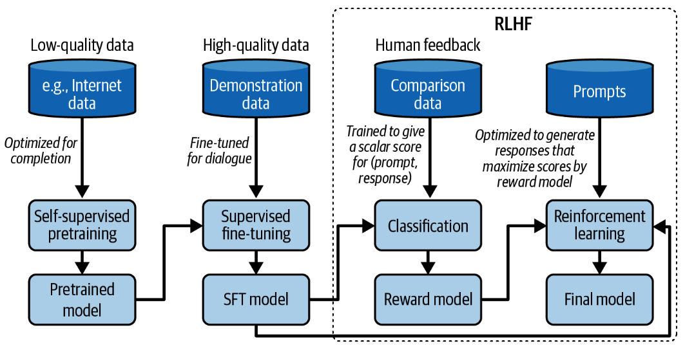

# Post-Training

Post-training starts with a pre-trained model. Let’s say that you’ve pre-trained a foundation model using self-supervision. Due to how pre-training works today, a pre-trained model typically has two issues. First, self-supervision optimizes the model for text completion, not conversations.[21](https://learning.oreilly.com/library/view/ai-engineering/9781098166298/ch02.html#id787) If you find this unclear, don’t worry, [“Supervised Finetuning”](https://learning.oreilly.com/library/view/ai-engineering/9781098166298/ch02.html#ch02_supervised_finetuning_1730147895572140) will have examples. Second, if the model is pre-trained on data indiscriminately scraped from the internet, its outputs can be racist, sexist, rude, or just wrong. The goal of post-training is to address both of these issues.

Every model’s post-training is different. However, in general, post-training consists of two steps:

1.  _Supervised finetuning_ (_SFT_): Finetune the pre-trained model on high-quality instruction data to optimize models for conversations instead of completion.
    
2.  _Preference finetuning_: Further finetune the model to output responses that align with human preference. Preference finetuning is typically done with reinforcement learning (RL).[22](https://learning.oreilly.com/library/view/ai-engineering/9781098166298/ch02.html#id790) Techniques for preference finetuning include [_reinforcement learning from human feedback_](https://oreil.ly/iJG1q) (RLHF) (used by [GPT-3.5](https://oreil.ly/tbgTi) and [Llama 2](https://arxiv.org/abs/2307.09288)),  [DPO](https://arxiv.org/abs/2305.18290) (Direct Preference Optimization) (used by [Llama 3](https://arxiv.org/abs/2407.21783)), and [_reinforcement learning from AI feedback_](https://arxiv.org/abs/2309.00267) (RLAIF) (potentially used by [Claude](https://arxiv.org/abs/2212.08073)).
    

Let me highlight the difference between pre-training and post-training another way. For language-based foundation models, pre-training optimizes token-level quality, where the model is trained to predict the next token accurately. However, users don’t care about token-level quality—they care about the quality of the entire response. Post-training, in general, optimizes the model to generate responses that users prefer. Some people compare pre-training to reading to acquire knowledge, while post-training is like learning how to use that knowledge.

###### Warning

>Watch out for terminology ambiguity. Some people use the term  _instruction finetuning_  to refer to supervised finetuning, while some other people use this term to refer to both supervised finetuning and preference finetuning. To avoid ambiguity, I will avoid the term instruction finetuning in this book.
As post-training consumes a small portion of resources compared to pre-training ([InstructGPT](https://oreil.ly/9bbzX)  used only 2% of compute for post-training and 98% for pre-training), you can think of post-training as unlocking the capabilities that the pre-trained model already has but are hard for users to access via prompting alone.

[Figure 1](../images/pre-training-workflow.jpg)  shows the overall workflow of pre-training, SFT, and preference finetuning, assuming you use RLHF for the last step. You can approximate how well a model aligns with human preference by determining what steps the model creators have taken.

###### The overall training workflow with pre-training, SFT, and RLHF.

If you squint,  [Figure 1](../images/pre-training-workflow.jpg)  looks very similar to the meme depicting the monster  [Shoggoth](https://en.wikipedia.org/wiki/Shoggoth)  with a smiley face in  [Figure 2](../images/shoggoth.jpg):

1.  Self-supervised pre-training results in a rogue model that can be considered an untamed monster because it uses indiscriminate data from the internet.
    
2.  This monster is then supervised finetuned on higher-quality data—Stack Overflow, Quora, or human annotations—which makes it more socially acceptable.
    
3.  This finetuned model is further polished using preference finetuning to make it customer-appropriate, which is like giving it a smiley face.

###### Shoggoth with a smiley face. Adapted from an original image shared by [anthrupad](https://x.com/anthrupad/status/1622349563922362368).
