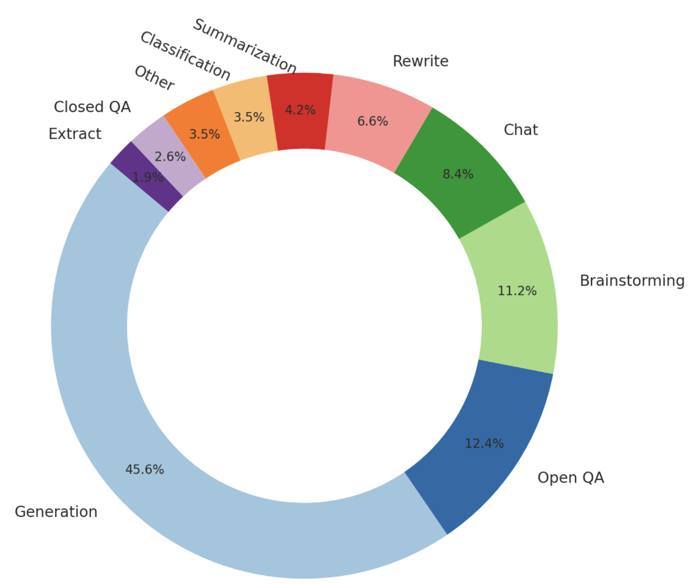
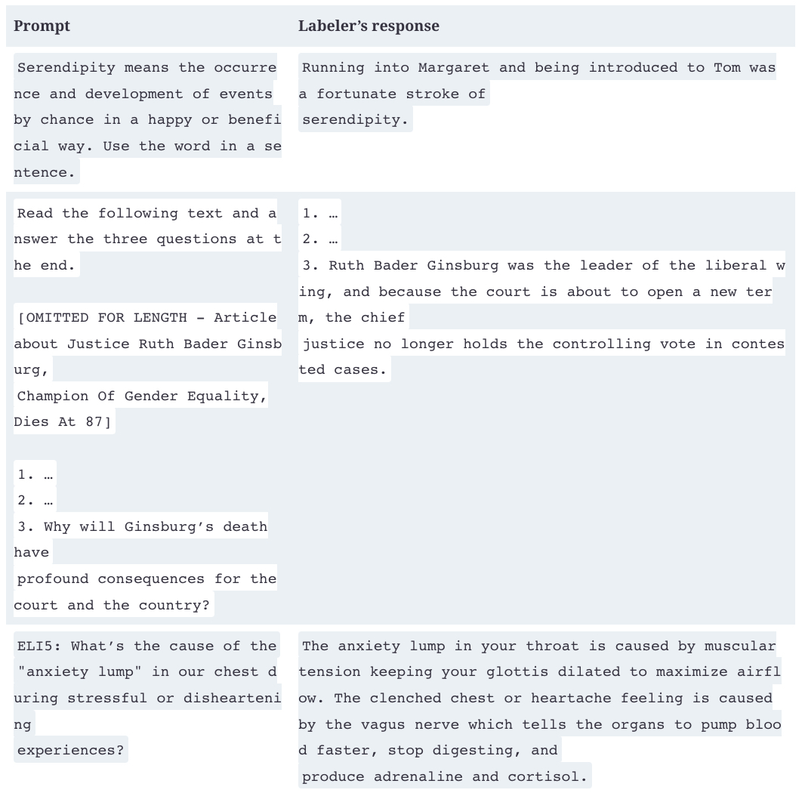

## Supervised Finetuning

As discussed in  [Chapter 1](https://learning.oreilly.com/library/view/ai-engineering/9781098166298/ch01.html#ch01_introduction_to_building_ai_applications_with_foun_1730130814984319), the pre-trained model is likely optimized for completion rather than conversing. If you input “How to make pizza” into the model, the model will continue to complete this sentence, as the model has no concept that this is supposed to be a conversation. Any of the following three options can be a valid completion:

1.  Adding more context to the question: “for a family of six?”
    
2.  Adding follow-up questions: “What ingredients do I need? How much time would it take?”
    
3.  Giving the instructions on how to make pizza.
    

If the goal is to respond to users appropriately, the correct option is 3.

We know that a model mimics its training data. To encourage a model to generate the appropriate responses, you can show examples of appropriate responses. Such examples follow the format (_prompt, response_) and are called _demonstration data_. Some people refer to this process as _behavior cloning_: you demonstrate how the model should behave, and the model clones this behavior.

Since different types of requests require different types of responses, your demonstration data should contain the range of requests you want your model to handle, such as question answering, summarization, and translation.  [Figure 1](../images/prompt-used-to-finetune-instructgpt.jpg)  shows a distribution of types of tasks OpenAI used to finetune their model  [InstructGPT](https://oreil.ly/8U2z8). Note that this distribution doesn’t contain multimodal tasks, as InstructGPT is a text-only model.

###### Figure 1. The distribution of prompts used to finetune InstructGPT. The graph is created based on the numbers from the OpenAI paper.

Good teachers are important for humans to learn. Similarly, good labelers are important for AIs to learn how to conduct intelligent conversations. Unlike traditional data labeling, which can often be done with little or no domain expertise, demonstration data may contain complex prompts whose responses require critical thinking, information gathering, and judgment about the appropriateness of the user’s requests. [Table 1](../images/examples-data-used-for-instructorgpt.jpg) shows examples of (prompt, response) pairs created by labelers for InstructGPT.

###### Table 1. Examples of demonstration data used for [InstructGPT](https://arxiv.org/abs/2203.02155).