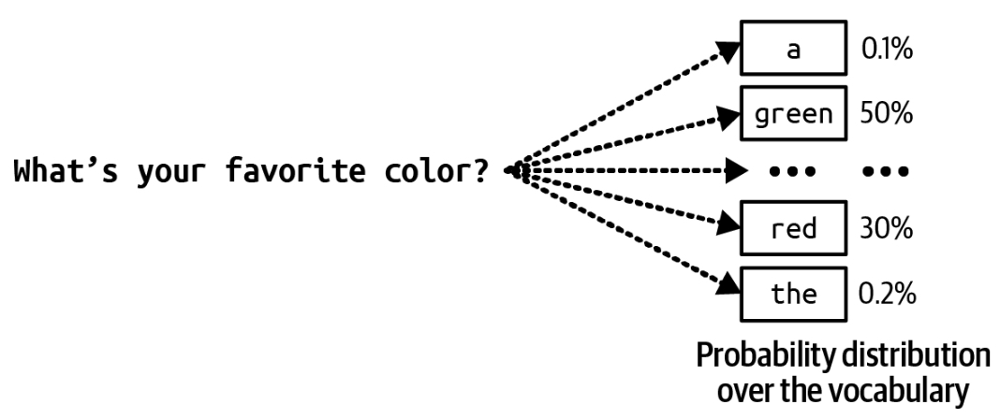
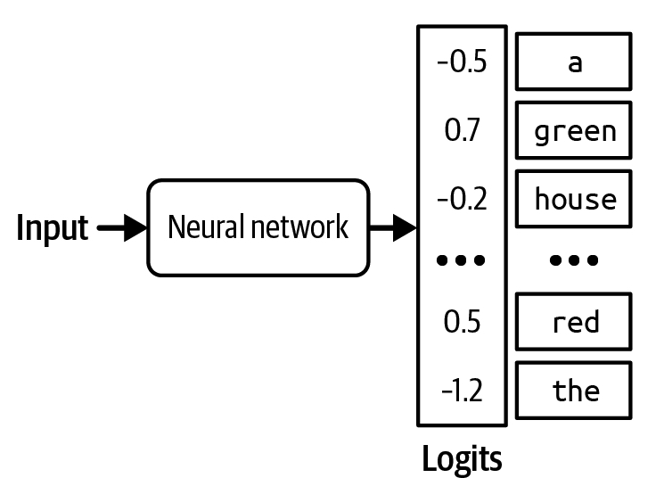
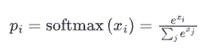
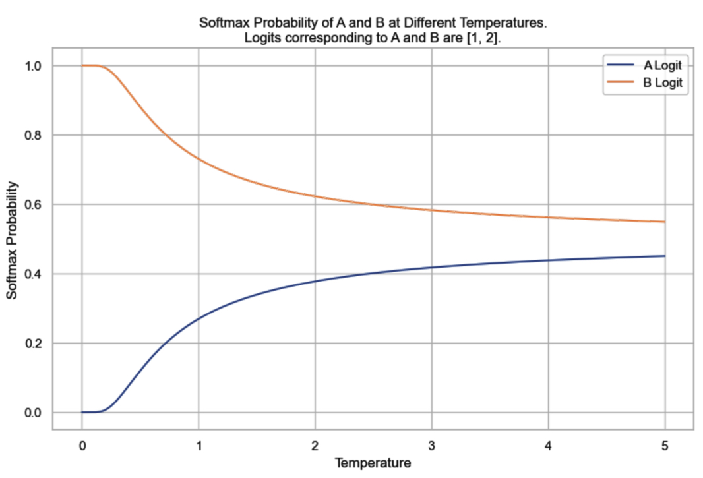
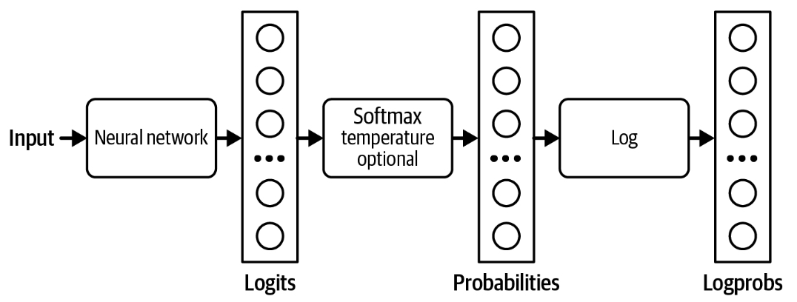

# Sampling

A model constructs its outputs through a process known as  _sampling_. This section discusses different sampling strategies and  _sampling variables,_  including temperature, top-k, and top-p. It’ll then explore how to sample multiple outputs to improve a model’s performance. We’ll also see how the sampling process can be modified to get models to generate responses that follow certain formats and constraints.

Sampling makes AI’s outputs probabilistic. Understanding this probabilistic nature is important for handling AI’s behaviors, such as inconsistency and hallucination. This section ends with a deep dive into what this probabilistic nature means and how to work with it.

## Sampling Fundamentals

Given an input, a neural network produces an output by first computing the probabilities of possible outcomes. For a classification model, possible outcomes are the available classes. As an example, if a model is trained to classify whether an email is spam or not, there are only two possible outcomes: spam and not spam. The model computes the probability of each of these two outcomes—e.g., the probability of the email being spam is 90%, and not spam is 10%. You can then make decisions based on these output probabilities. For example, if you decide that any email with a spam probability higher than 50% should be marked as spam, an email with a 90% spam probability will be marked as spam.

For a language model, to generate the next token, the model first computes the probability distribution over all tokens in the vocabulary, which looks like  [Figure 1](../images/probability-distribution-over-all-tokens.jpg).

.
###### Figure 1. To generate the next token, the language model first computes the probability distribution over all tokens in the vocabulary.

When working with possible outcomes of different probabilities, a common strategy is to pick the outcome with the highest probability. Always picking the most likely outcome = is called  _greedy sampling_. This often works for classification tasks. For example, if the model thinks that an email is more likely to be spam than not spam, it makes sense to mark it as spam. However, for a language model, greedy sampling creates boring outputs. Imagine a model that, for whatever question you ask, always responds with the most common words.

Instead of always picking the next most likely token, the model can sample the next token according to the probability distribution over all possible values. Given the context of “My favorite color is …” as shown in  [Figure 1](../images/probability-distribution-over-all-tokens.jpg), if “red” has a 30% chance of being the next token and “green” has a 50% chance, “red” will be picked 30% of the time, and “green” 50% of the time.

How does a model compute these probabilities? Given an input, a neural network outputs a logit vector. Each  _logit_  corresponds to one possible value. In the case of a language model, each logit corresponds to one token in the model’s vocabulary. The logit vector size is the size of the vocabulary. A visualization of the logits vector is shown in  [Figure 2](../images/logit-vector.jpg).

###### Figure 2. For each input, a language model produces a logit vector. Each logit corresponds to a token in the vocabulary.

While larger logits correspond to higher probabilities, logits don’t represent probabilities. Logits don’t sum up to one. Logits can even be negative, while probabilities have to be non-negative. To convert logits to probabilities, a softmax layer is often used. Let’s say the model has a vocabulary of N and the logit vector is [x1,x2,...,xN] The probability for the _ith_ token, pi is computed as follows:

## Sampling Strategies

The right sampling strategy can make a model generate responses more suitable for your application. For example, one sampling strategy can make the model generate more creative responses, whereas another strategy can make its generations more predictable. Many different sample strategies have been introduced to nudge models toward responses with specific attributes. You can also design your own sampling strategy, though this typically requires access to the model’s logits. Let’s go over a few common sampling strategies to see how they work.

### Temperature

One problem with sampling the next token according to the probability distribution is that the model can be less creative. In the previous example, common colors like “red”, “green”, “purple”, and so on have the highest probabilities. The language model’s answer ends up sounding like that of a five-year-old: “My favorite color is green”. Because “the” has a low probability, the model has a low chance of generating a creative sentence such as “My favorite color is the color of a still lake on a spring  morning”.

To redistribute the probabilities of the possible values, you can sample with a  _temperature_. Intuitively, a higher temperature reduces the probabilities of common tokens, and as a result, increases the probabilities of rarer tokens. This enables models to create more creative responses.

Temperature is a constant used to adjust the logits before the softmax transformation. Logits are divided by temperature. For a given temperature  _T_, the adjusted logit for the  _ith_  token is  xiT. Softmax is then applied on this adjusted logit instead of on  xi.

Let’s walk through a simple example to examine the effect of temperature on probabilities. Imagine that we have a model that has only two possible outputs: A and B. The logits computed from the last layer are [1, 2]. The logit for A is 1 and B is 2.

Without using temperature, which is equivalent to using the temperature of 1, the softmax probabilities are [0.27, 0.73]. The model picks B 73% of the time.

With temperature = 0.5, the probabilities are [0.12, 0.88]. The model now picks B 88% of the time.

The higher the temperature, the less likely it is that the model is going to pick the most obvious value (the value with the highest logit), making the model’s outputs more creative but potentially less coherent. The lower the temperature, the more likely it is that the model is going to pick the most obvious value, making the model’s output more consistent but potentially more boring.[24](https://learning.oreilly.com/library/view/ai-engineering/9781098166298/ch02.html#id816)

[Figure 3](../images/softmax-probability.jpg)  shows the softmax probabilities for tokens A and B at different temperatures. As the temperature gets closer to 0, the probability that the model picks token B becomes closer to 1. In our example, for a temperature below 0.1, the model almost always outputs B. As the temperature increases, the probability that token A is picked increases while the probability that token B is picked decreases. Model providers typically limit the temperature to be between 0 and 2. If you own your model, you can use any non-negative temperature. A temperature of 0.7 is often recommended for creative use cases, as it balances creativity and predictability, but you should experiment and find the temperature that works best for you.

###### Figure 3. The softmax probabilities for tokens A and B at different temperatures, given their logits being [1, 2]. Without setting the temperature value, which is equivalent to using the temperature of 1, the softmax probability of B would be 73%.

It’s common practice to set the temperature to 0 for the model’s outputs to be more consistent. Technically, temperature can never be 0—logits can’t be divided by 0. In practice, when we set the temperature to 0, the model just picks the token with the largest logit,[25](https://learning.oreilly.com/library/view/ai-engineering/9781098166298/ch02.html#id817)  without doing logit adjustment and softmax calculation.

###### Tip

> A common debugging technique when working with an AI model is to look at the probabilities this model computes for given inputs. For example, if the probabilities look random, the model hasn’t learned much.

Many model providers return probabilities generated by their models as  [logprobs](https://oreil.ly/VAUl6).  _Logprobs_, short for  _log probabilities_, are probabilities in the log scale. Log scale is preferred when working with a neural network’s probabilities because it helps reduce the  [underflow](https://en.wikipedia.org/wiki/Arithmetic_underflow)  problem.[26](https://learning.oreilly.com/library/view/ai-engineering/9781098166298/ch02.html#id819)  A language model might be working with a vocabulary size of 100,000, which means the probabilities for many of the tokens can be too small to be represented by a machine. The small numbers might be rounded down to 0. Log scale helps reduce this problem.

[Figure 4](../images/logprobs.jpg)  shows the workflow of how logits, probabilities, and logprobs are  computed.

###### Figure 4. How logits, probabilities, and logprobs are computed.

As you’ll see throughout the book, logprobs are useful for building applications (especially for classification), evaluating applications, and understanding how models work under the hood. However, as of this writing, many model providers don’t expose their models’ logprobs, or if they do, the logprobs API is limited.[27](https://learning.oreilly.com/library/view/ai-engineering/9781098166298/ch02.html#id820) The limited logprobs API is likely due to security reasons as a model’s exposed logprobs make it easier for others to replicate the model.

### Top-k

_Top-k_  is a sampling strategy to reduce the computation workload without sacrificing too much of the model’s response diversity. Recall that a softmax layer is used to compute the probability distribution over all possible values. Softmax requires two passes over all possible values: one to perform the exponential sum  ∑jexj, and one to perform  exi∑jexj  for each value. For a language model with a large vocabulary, this process is computationally expensive.

To avoid this problem, after the model has computed the logits, we pick the top-k logits and perform softmax over these top-k logits only. Depending on how diverse you want your application to be, k can be anywhere from 50 to 500—much smaller than a model’s vocabulary size. The model then samples from these top values. A smaller k value makes the text more predictable but less interesting, as the model is limited to a smaller set of likely words.

### Top-p

In top-k sampling, the number of values considered is fixed to k. However, this number should change depending on the situation. For example, given the prompt “Do you like music? Answer with only yes or no.” the number of values considered should be two: yes and no. Given the prompt “What’s the meaning of life?” the number of values considered should be much larger.

_Top-p_, also known as  _nucleus sampling_, allows for a more dynamic selection of values to be sampled from. In top-p sampling, the model sums the probabilities of the most likely next values in descending order and stops when the sum reaches p. Only the values within this cumulative probability are considered. Common values for top-p (nucleus) sampling in language models typically range from 0.9 to 0.95. A top-p value of 0.9, for example, means that the model will consider the smallest set of values whose cumulative probability exceeds 90%.

### Stopping condition

An autoregressive language model generates sequences of tokens by generating one token after another. A long output sequence takes more time, costs more compute (money),[28](https://learning.oreilly.com/library/view/ai-engineering/9781098166298/ch02.html#id829)  and can sometimes annoy users. We might want to set a condition for the model to stop the sequence.

One easy method is to ask models to stop generating after a fixed number of tokens. The downside is that the output is likely to be cut off mid-sentence. Another method is to use  _stop tokens_  or  _stop words_. For example, you can ask a model to stop generating when it encounters the end-of-sequence token. Stopping conditions are helpful to keep latency and costs down.

The downside of early stopping is that if you want models to generate outputs in a certain format, premature stopping can cause outputs to be malformatted. For example, if you ask the model to generate JSON, early stopping can cause the output JSON to be missing things like closing brackets, making the generated JSON hard to parse.

## Test Time Compute

The last section discussed how a model might sample the next token. This section discusses how a model might sample the whole output.

One simple way to improve a model’s response quality is  _test time compute_: instead of generating only one response per query, you generate multiple responses to increase the chance of good responses. One way to do test time compute is the best of N technique discussed earlier in this chapter—you randomly generate multiple outputs and pick one that works best. However, you can also be more strategic about how to generate multiple outputs. For example, instead of generating all outputs independently, which might include many less promising candidates, you can use  [beam search](https://en.wikipedia.org/wiki/Beam_search)  to generate a fixed number of most promising candidates (the beam) at each step of sequence generation.

A simple strategy to increase the effectiveness of test time compute is to increase the diversity of the outputs, because a more diverse set of options is more likely to yield better candidates. If you use the same model to generate different options, it’s often a good practice to vary the model’s sampling variables to diversify its outputs.

Although you can usually expect some model performance improvement by sampling multiple outputs, it’s expensive. On average, generating two outputs costs approximately twice as much as generating one.[29](https://learning.oreilly.com/library/view/ai-engineering/9781098166298/ch02.html#id833)

To pick the best output, you can either show users multiple outputs and let them choose the one that works best for them, or you can devise a method to select the best one. One selection method is to pick the output with the highest probability. A language model’s output is a sequence of tokens, and each token has a probability computed by the model. The probability of an output is the product of the probabilities of all tokens in the output.