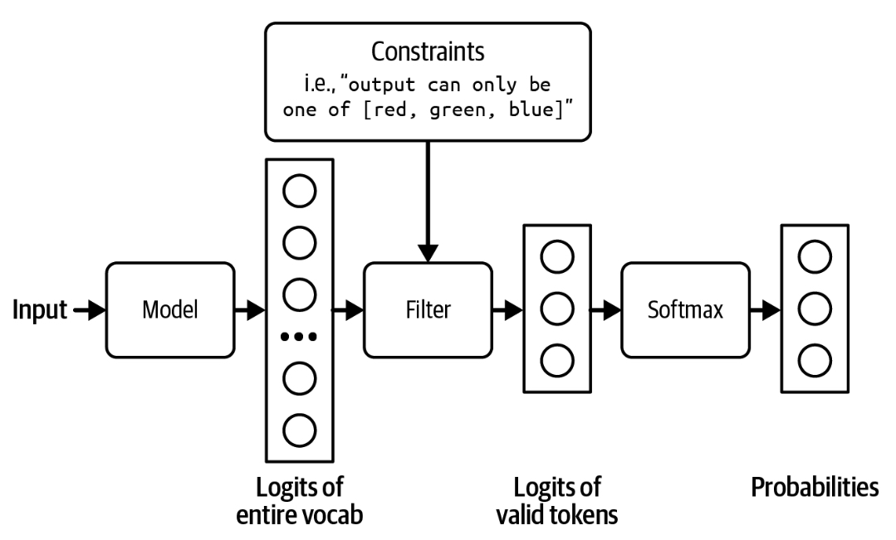
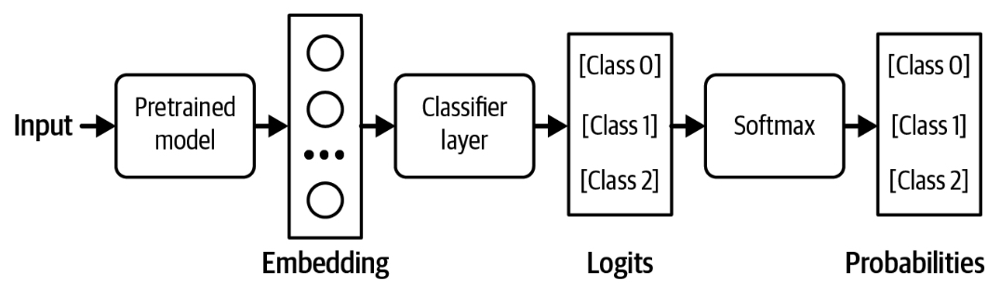

## Structured Outputs

Often, in production, you need models to generate outputs following certain formats. Structured outputs are crucial for the following two scenarios:

1.  _Tasks requiring structured outputs._  The most common category of tasks in this scenario is semantic parsing. Semantic parsing involves converting natural language into a structured, machine-readable format.  Text-to-SQL is an example of semantic parsing, where the outputs must be valid SQL queries. Semantic parsing allow users to interact with APIs using a natural language (e.g., English). For example, text-to-PostgreSQL allows users to query a Postgres database using English queries such as “What’s the average monthly revenue over the last 6 months” instead of writing it in PostgreSQL.
Other categories of tasks in this scenario include classification where the outputs have to be valid classes.
2.  _Tasks whose outputs are used by downstream applications._  In this scenario, the task itself doesn’t need the outputs to be structured, but because the outputs are used by other applications, they need to be parsable by these applications.
    
    For example, if you use an AI model to write an email, the email itself doesn’t have to be structured. However, a downstream application using this email might need it to be in a specific format—for example, a JSON document with specific keys, such as  `{"title": [TITLE], "body": [EMAIL BODY]}`.
    
    _This is especially important for agentic workflows_  where a model’s outputs are often passed as inputs into tools that the model can use, as discussed in  [Chapter 6](https://learning.oreilly.com/library/view/ai-engineering/9781098166298/ch06.html#ch06_rag_and_agents_1730157386571386).
Frameworks that support structured outputs include [guidance](https://github.com/guidance-ai/guidance), [outlines](https://github.com/dottxt-ai/outlines), [instructor](https://github.com/instructor-ai/instructor), and [llama.cpp](https://github.com/ggerganov/llama.cpp/discussions/177). Each model provider might also use their own techniques to improve their models’ ability to generate structured outputs. OpenAI was the first model provider to introduce [_JSON mode_](https://oreil.ly/NxZDF) in their text generation API. Note that an API’s JSON mode typically guarantees only that the outputs are valid JSON—not the content of the JSON objects. The otherwise valid generated JSONs can also be truncated, and thus not parsable, if the generation stops too soon, such as when it reaches the maximum output token length. However, if the max token length is set too long, the model’s responses become both too slow and expensive.

You can guide a model to generate structured outputs at different layers of the AI stack: prompting, post-processing, test time compute, constrained sampling, and finetuning. The first three are more like bandages. They work best if the model is already pretty good at generating structured outputs and just needs a little nudge. For intensive treatment, you need constrained sampling and finetuning.

Test time compute has just been discussed in the previous section—keep on generating outputs until one fits the expected format. This section focuses on the other four approaches.

### Prompting

Prompting is the first line of action for structured outputs. You can instruct a model to generate outputs in any format. However, whether a model can follow this instruction depends on the model’s instruction-following capability (discussed in  [Chapter 4](https://learning.oreilly.com/library/view/ai-engineering/9781098166298/ch04.html#ch04_evaluate_ai_systems_1730130866187863)), and the clarity of the instruction (discussed in  [Chapter 5](https://learning.oreilly.com/library/view/ai-engineering/9781098166298/ch05.html#ch05a_prompt_engineering_1730156991195551)). While models are getting increasingly good at following instructions, there’s no guarantee that they’ll always follow your instructions.[33](https://learning.oreilly.com/library/view/ai-engineering/9781098166298/ch02.html#id844)  A few percentage points of invalid model outputs can still be unacceptable for many applications.

To increase the percentage of valid outputs, some people use AI to validate and/or correct the output of the original prompt. This is an example of the AI as a judge approach discussed in  [Chapter 3](https://learning.oreilly.com/library/view/ai-engineering/9781098166298/ch03.html#ch03a_evaluation_methodology_1730150757064067). This means that for each output, there will be at least two model queries: one to generate the output and one to validate it. While the added validation layer can significantly improve the validity of the outputs, the extra cost and latency incurred by the extra validation queries can make this approach too expensive for some.

### Post-processing

Post-processing is simple and cheap but can work surprisingly well. During my time teaching, I noticed that students tended to make very similar mistakes. When I started working with foundation models, I noticed the same thing. A model tends to repeat similar mistakes across queries. This means if you find the common mistakes  a model  makes, you can potentially write a script to correct them. For example, if the generated JSON object misses a closing bracket, manually add that bracket.  LinkedIn’s  defensive YAML parser increased the percentage of correct YAML outputs from 90% to 99.99% ([Bottaro and Ramgopal, 2020](https://oreil.ly/ZTRaA)).

Post-processing works only if the mistakes are easy to fix. This usually happens if a model’s outputs are already mostly correctly formatted, with occasional small errors.

### Constrained sampling

_Constraint sampling_  is a technique for guiding the generation of text toward certain constraints. It is typically followed by structured output tools.

At a high level, to generate a token, the model samples among values that meet the constraints. Recall that to generate a token, your model first outputs a logit vector, each logit corresponding to one possible token. Constrained sampling filters this logit vector to keep only the tokens that meet the constraints. It then samples from these valid tokens. This process is shown in  [Figure 1](../images/filter-out-logits.jpg).

###### Figure 1. Filter out logits that don’t meet the constraints in order to sample only among valid outputs.

In the example in  [Figure 1](../images/filter-out-logits.jpg), the constraint is straightforward to filter for. However, most cases aren’t that straightforward. You need to have a grammar that specifies what is and isn’t allowed at each step. For example, JSON grammar dictates that after  `{`, you can’t have another  `{`  unless it’s part of a string, as in  `{"key": "{{string}}"}`.

Building out that grammar and incorporating it into the sampling process is nontrivial. Because each output format—JSON, YAML, regex, CSV, and so on—needs its own grammar, constraint sampling is less generalizable. Its use is limited to the formats whose grammars are supported by external tools or by your team. Grammar verification can also increase generation latency ([Brandon T. Willard, 2024](https://oreil.ly/hNRf4)).

Some are against constrained sampling because they believe the resources needed for constrained sampling are better invested in training models to become better at following instructions.

### Finetuning

Finetuning a model on examples following your desirable format is the most effective and general approach to get models to generate outputs in this format.[34](https://learning.oreilly.com/library/view/ai-engineering/9781098166298/ch02.html#id849)  It can work with any expected format. While simple finetuning doesn’t guarantee that the model will always output the expected format, it is much more reliable than prompting.

For certain tasks, you can guarantee the output format by modifying the model’s architecture before finetuning. For example, for classification, you can append a classifier head to the foundation model’s architecture to make sure that the model outputs only one of the pre-specified classes. The architecture looks like  [Figure 2](../images/feature-based-transfer.jpg).[35](https://learning.oreilly.com/library/view/ai-engineering/9781098166298/ch02.html#id850)  This approach is also called  _feature-based transfer_ and is discussed more with other transfer learning techniques in  [Chapter 7](https://learning.oreilly.com/library/view/ai-engineering/9781098166298/ch07.html#ch07).

###### Figure 2. Adding a classifier head to your base model to turn it into a classifier. In this example, the classifier works with three classes.

During finetuning, you can retrain the whole model end-to-end or part of the model, such as this classifier head. End-to-end training requires more resources, but promises better performance.

We need techniques for structured outputs because of the assumption that the model, by itself, isn’t capable of generating structured outputs. However, as models become more powerful, we can expect them to get better at following instructions. I suspect that in the future, it’ll be easier to get models to output exactly what we need with minimal prompting, and these techniques will become less important.
