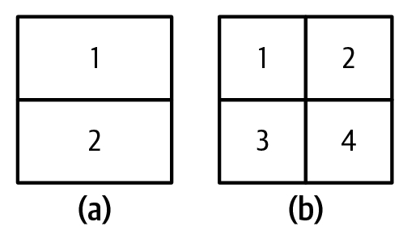

# Understanding Language Modeling Metrics

Foundation models evolved out of language models. Many foundation models still have language models as their main components. For these models, the performance of the language model component tends to be well correlated to the foundation model’s performance on downstream applications ([Liu et al., 2023](https://oreil.ly/vX-My)). Therefore, a rough understanding of language modeling metrics can be quite helpful in understanding downstream performance.[6](https://learning.oreilly.com/library/view/ai-engineering/9781098166298/ch03.html#id878)

As discussed in  [Chapter 1](https://learning.oreilly.com/library/view/ai-engineering/9781098166298/ch01.html#ch01_introduction_to_building_ai_applications_with_foun_1730130814984319), language modeling has been around for decades, popularized by Claude Shannon in his 1951 paper “Prediction and Entropy of Printed English”. The metrics used to guide the development of language models haven’t changed much since then. Most autoregressive language models are trained using cross entropy or its relative, perplexity. When reading papers and model reports, you might also come across bits-per-character (BPC) and bits-per-byte (BPB); both are variations of cross entropy.

All four metrics—cross entropy, perplexity, BPC, and BPB—are closely related. If you know the value of one, you can compute the other three, given the necessary information. While I refer to them as language modeling metrics, they can be used for any model that generates sequences of tokens, including non-text tokens.

Recall that a language model encodes statistical information (how likely a token is to appear in a given context) about languages. Statistically, given the context “I like drinking __”, the next word is more likely to be “tea” than “charcoal”. The more statistical information that a model can capture, the better it is at predicting the next token.

In ML lingo, a language model learns the distribution of its training data. The better this model learns, the better it is at predicting what comes next in the training data, and the lower its training cross entropy. As with any ML model, you care about its performance not just on the training data but also on your production data. In general, the closer your data is to a model’s training data, the better the model can perform on your data.

Compared to the rest of the book, this section is math-heavy. If you find it confusing, feel free to skip the math part and focus on the discussion of how to interpret these metrics. Even if you’re not training or finetuning language models, understanding these metrics can help with evaluating which models to use for your application. These metrics can occasionally be used for certain evaluation and data deduplication techniques, as discussed throughout this book.

## Entropy

_Entropy_  measures how much information, on average, a token carries. The higher the entropy, the more information each token carries, and the more bits are needed to represent a token.[7](https://learning.oreilly.com/library/view/ai-engineering/9781098166298/ch03.html#id881)

Let’s use a simple example to illustrate this. Imagine you want to create a language to describe positions within a square, as shown in  [Figure 1](../images/two-languages.jpg). If your language has only two tokens, shown as (a) in  [Figure 1](../images/two-languages.jpg), each token can tell you whether the position is upper or lower. Since there are only two tokens, one bit is sufficient to represent them. The entropy of this language is, therefore, 1.

###### Figure 1. Two languages describe positions within a square. Compared to the language on the left (a), the tokens on the right (b) carry more information, but they need more bits to represent them.

If your language has four tokens, shown as (b) in  [Figure 1](../images/two-languages.jpg), each token can give you a more specific position: upper-left, upper-right, lower-left, or lower-right. However, since there are now four tokens, you need two bits to represent them. The entropy of this language is 2. This language has higher entropy, since each token carries more information, but each token requires more bits to represent.

Intuitively, entropy measures how difficult it is to predict what comes next in a language. The lower a language’s entropy (the less information a token of a language carries), the more predictable that language. In our previous example, the language with only two tokens is easier to predict than the language with four (you have to predict among only two possible tokens compared to four). This is similar to how, if you can perfectly predict what I will say next, what I say carries no new information.

## Cross Entropy

When you train a language model on a dataset, your goal is to get the model to learn the distribution of this training data. In other words, your goal is to get the model to predict what comes next in the training data. A language model’s cross entropy on a dataset measures how difficult it is for the language model to predict what comes next in this dataset.

A model’s cross entropy on the training data depends on two qualities:

1.  The training data’s predictability, measured by the training data’s entropy
    
2.  How the distribution captured by the language model diverges from the true distribution of the training data
    

Entropy and cross entropy share the same mathematical notation,  _H_. Let  _P_  be the true distribution of the training data, and  _Q_  be the distribution learned by the language model. Accordingly, the following is true:

-   The training data’s entropy is, therefore,  _H_(_P_).
-   The divergence of  _Q_  with respect to  _P_  can be measured using the Kullback–Leibler (KL) divergence, which is mathematically represented as  DKL(P||Q).
-   The model’s cross entropy with respect to the training data is therefore:  H(P,Q)=H(P)+DKL(P||Q).
    

Cross entropy isn’t symmetric. The cross entropy of  _Q_  with respect to  _P_—_H_(_P_,  _Q_)—is different from the cross entropy of  _P_  with respect to  _Q_—_H_(_Q_,  _P_).

A language model is trained to minimize its cross entropy with respect to the training data. If the language model learns perfectly from its training data, the model’s cross entropy will be exactly the same as the entropy of the training data. The KL divergence of Q with respect to P will then be 0. You can think of a model’s cross entropy as its approximation of the entropy of its training data.

## Bits-per-Character and Bits-per-Byte

One unit of entropy and cross entropy is bits. If the cross entropy of a language model is 6 bits, this language model needs 6 bits to represent each token.

Since different models have different tokenization methods—for example, one model uses words as tokens and another uses characters as tokens—the number of bits per token isn’t comparable across models. Some use the number of  _bits-per-character_  (BPC) instead. If the number of bits per token is 6 and on average, each token consists of 2 characters, the BPC is 6/2 = 3.

One complication with BPC arises from different character encoding schemes. For example, with ASCII, each character is encoded using 7 bits, but with UTF-8, a character can be encoded using anywhere between 8 and 32 bits. A more standardized metric would be  _bits-per-byte_ (BPB), the number of bits a language model needs to represent one byte of the original training data. If the BPC is 3 and each character is 7 bits, or ⅞ of a byte, then the BPB is 3 / (⅞) = 3.43.

Cross entropy tells us how efficient a language model will be at compressing text. If the BPB of a language model is 3.43, meaning it can represent each original byte (8 bits) using 3.43 bits, this language model can compress the original training text to less than half the text’s original size.

## Perplexity

_Perplexity_  is the exponential of entropy and cross entropy. Perplexity is often shortened to PPL. Given a dataset with the true distribution  _P_, its perplexity is defined as:

PPL(P)=2H(P)

The perplexity of a language model (with the learned distribution  _Q_) on this dataset is defined as:

PPL(P,Q)=2H(P,Q)

If cross entropy measures how difficult it is for a model to predict the next token, perplexity measures the amount of uncertainty it has when predicting the next token. Higher uncertainty means there are more possible options for the next token.

Consider a language model trained to encode the 4 position tokens, as in  [Figure 3-4](https://learning.oreilly.com/library/view/ai-engineering/9781098166298/ch03.html#ch03a_figure_4_1730150757025074)  (b), perfectly. The cross entropy of this language model is 2 bits. If this language model tries to predict a position in the square, it has to choose among 2  = 4 possible options. Thus, this language model has a perplexity of 4.

So far, I’ve been using  _bit_  as the unit for entropy and cross entropy. Each bit can represent 2 unique values, hence the base of 2 in the preceding perplexity equation.

Popular ML frameworks, including TensorFlow and PyTorch, use  _nat_  (natural log) as the unit for entropy and cross entropy. Nat uses the  [base of  _e_](https://en.wikipedia.org/wiki/E_(mathematical_constant)), the base of natural logarithm.[8](https://learning.oreilly.com/library/view/ai-engineering/9781098166298/ch03.html#id892)  If you use  _nat_  as the unit, perplexity is the exponential of  _e_:

PPL(P,Q)=eH(P,Q)

Due to the confusion around  _bit_  and  _nat_, many people report perplexity, instead of cross entropy, when reporting their language models’ performance.

## Perplexity Interpretation and Use Cases

As discussed, cross entropy, perplexity, BPC, and BPB are variations of language models’ predictive accuracy measurements. The more accurately a model can predict a text, the lower these metrics are. In this book, I’ll use perplexity as the default  language  modeling metric. Remember that the more uncertainty the model has in predicting what comes next in a given dataset, the higher the perplexity.

What’s considered a good value for perplexity depends on the data itself and how exactly perplexity is computed, such as how many previous tokens a model has access to. Here are some general rules:

*More structured data gives lower expected perplexity*

 - More structured data is more predictable. For example, HTML code is
   more predictable than everyday text. If you see an opening HTML tag
   like  `<head>,`  you can predict that there should be a closing tag, 
   `</head>,`  nearby. Therefore, the expected perplexity of a model on
   HTML code should be lower than the expected perplexity of a model on
   everyday text.

*The bigger the vocabulary, the higher the perplexity*

 - Intuitively, the more possible tokens there are, the harder it is for
   the model to predict the next token. For example, a model’s
   perplexity on a children’s book will likely be lower than the same
   model’s perplexity on  _War and Peace_. For the same dataset, say in
   English, character-based perplexity (predicting the next character)
   will be lower than word-based perplexity (predicting the next word),
   because the number of possible characters is smaller than the number
   of possible words.

*The longer the context length, the lower the perplexity*

 - The more context a model has, the less uncertainty it will have in
   predicting the next token. In 1951, Claude Shannon evaluated his
   model’s cross entropy by using it to predict the next token
   conditioned on up to 10 previous tokens. As of this writing, a
   model’s perplexity can typically be computed and conditioned on
   between 500 and 10,000 previous tokens, and possibly more,
   upperbounded by the model’s maximum context length.

For reference, it’s not uncommon to see perplexity values as low as 3 or even lower. If all tokens in a hypothetical language have an equal chance of happening, a perplexity of 3 means that this model has a 1 in 3 chance of predicting the next token correctly. Given that a model’s vocabulary is in the order of 10,000s and 100,000s, these odds are incredible.

Other than guiding the training of language models, perplexity is useful in many parts of an AI engineering workflow. First, perplexity is a good proxy for a model’s capabilities. If a model’s bad at predicting the next token, its performance on downstream tasks will also likely be bad. OpenAI’s GPT-2 report shows that larger models, which are also more powerful models, consistently give lower perplexity on a range of datasets.