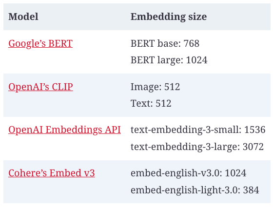

## Introduction to Embedding

Since computers work with numbers, a model needs to convert its input into numerical representations that computers can process.  _An embedding is a numerical representation that aims to capture the meaning of the original data._

An embedding is a vector. For example, the sentence  _“the cat sits on a mat”_  might be represented using an embedding vector that looks like this:  `[0.11, 0.02, 0.54]`. Here, I use a small vector as an example. In reality, the size of an embedding vector (the number of elements in the embedding vector) is typically between 100 and 10,000.[13](https://learning.oreilly.com/library/view/ai-engineering/9781098166298/ch03.html#id927)

Models trained especially to produce embeddings include the open source models BERT, CLIP (Contrastive Language–Image Pre-training), and  [Sentence Transformers](https://github.com/UKPLab/sentence-transformers). There are also proprietary embedding models provided as APIs.[14](https://learning.oreilly.com/library/view/ai-engineering/9781098166298/ch03.html#id929).
[Table 1](../images/embedding-sizes.jpg)  shows the embedding sizes of some popular models.

###### Table 1. Embedding sizes used by common models.

Because models typically require their inputs to first be transformed into vector representations, many ML models, including GPTs and Llamas, also involve a step to generate embeddings.  [“Transformer architecture”](https://learning.oreilly.com/library/view/ai-engineering/9781098166298/ch02.html#ch02_transformer_architecture_1730147895571820)  visualizes the embedding layer in a transformer model. If you have access to the intermediate layers of these models, you can use them to extract embeddings. However, the quality of these embeddings might not be as good as the embeddings generated by specialized embedding models.

The goal of the embedding algorithm is to produce embeddings that capture the essence of the original data. How do we verify that? The embedding vector  `[0.11, 0.02, 0.54]`  looks nothing like the original text “the cat sits on a mat”.

At a high level, an embedding algorithm is considered good if more-similar texts have closer embeddings, measured by cosine similarity or related metrics. The embedding of the sentence “the cat sits on a mat” should be closer to the embedding of “the dog plays on the grass” than the embedding of “AI research is super fun”.

You can also evaluate the quality of embeddings based on their utility for your task. Embeddings are used in many tasks, including classification, topic modeling, recommender systems, and RAG. An example of benchmarks that measure embedding quality on multiple tasks is MTEB, Massive Text Embedding Benchmark ([Muennighoff et al., 2023](https://arxiv.org/abs/2210.07316)).

I use texts as examples, but any data can have embedding representations. For example, ecommerce solutions like  [Criteo](https://arxiv.org/abs/1607.07326)  and  [Coveo](https://oreil.ly/a6jbV)  have embeddings for products.  [Pinterest](https://oreil.ly/uJNFH)  has embeddings for images, graphs, queries, and even users.

A new frontier is to create joint embeddings for data of different modalities. CLIP ([Radford et al., 2021](https://arxiv.org/abs/2103.00020)) was one of the first major models that could map data of different modalities, text and images, into a joint embedding space. ULIP (unified representation of language, images, and point clouds), ([Xue et al., 2022](https://arxiv.org/abs/2212.05171)) aims to create unified representations of text, images, and 3D point clouds. ImageBind ([Girdhar et al., 2023](https://arxiv.org/abs/2305.05665)) learns a joint embedding across six different modalities, including text, images, and audio.

A joint embedding space that can represent data of different modalities is a _multimodal embedding space_. In a text–image joint embedding space, the embedding of an image of a man fishing should be closer to the embedding of the text “a fisherman” than the embedding of the text “fashion show”. This joint embedding space allows embeddings of different modalities to be compared and combined. For example, this enables text-based image search. Given a text, it helps you find images closest to this text.