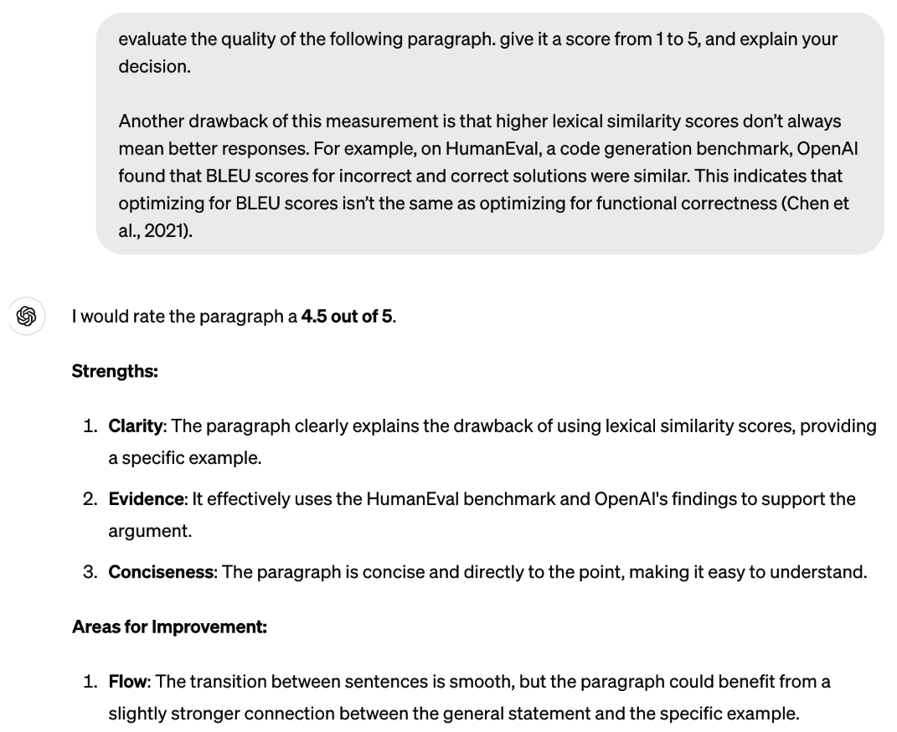
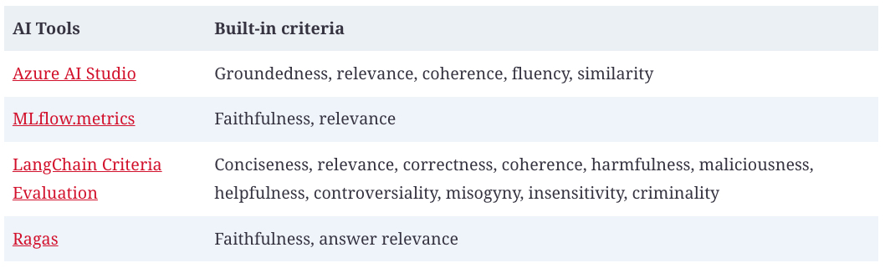
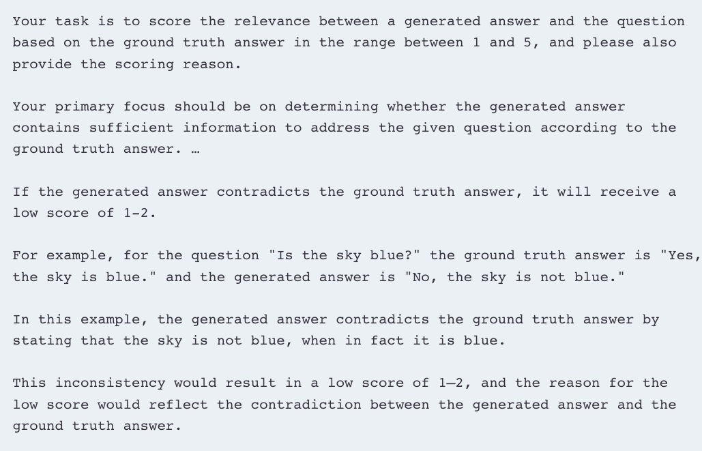
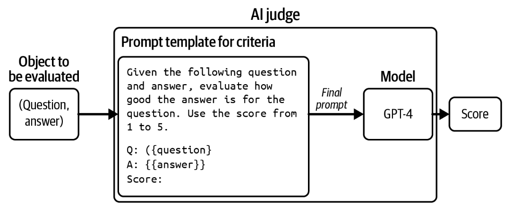
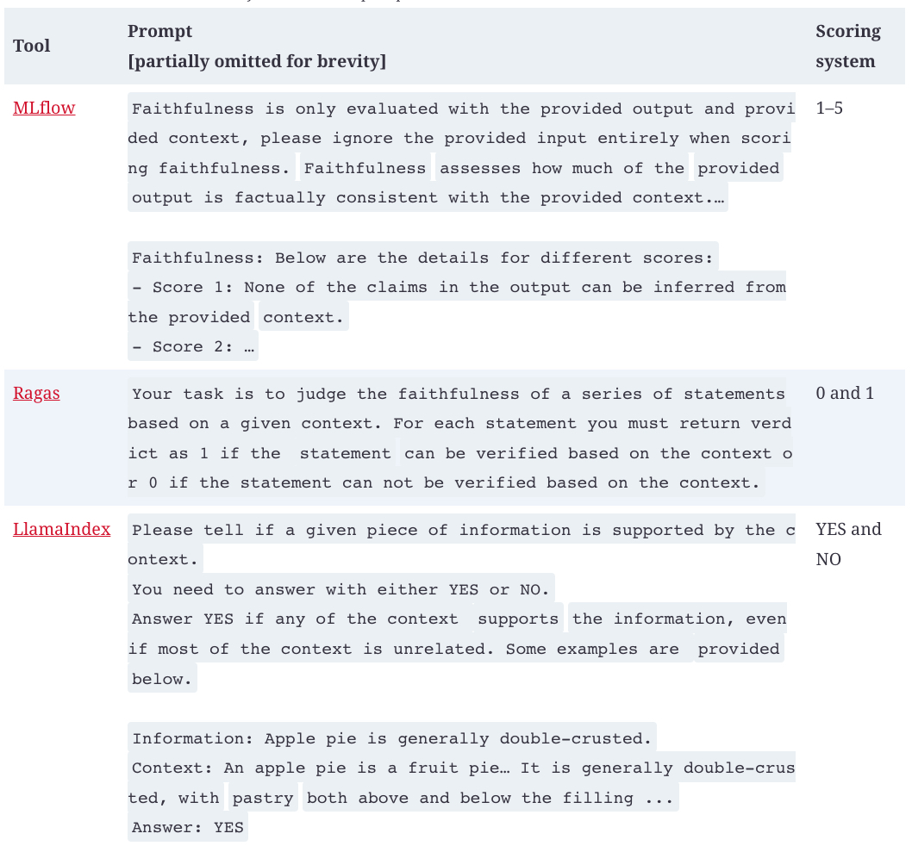

## Why AI as a Judge?

AI judges are fast, easy to use, and relatively cheap compared to human evaluators. They can also work without reference data, which means they can be used in production environments where there is no reference data.

You can ask AI models to judge an output based on any criteria: correctness, repetitiveness, toxicity, wholesomeness, hallucinations, and more. This is similar to how you can ask a person to give their opinion about anything. You might think, “But you can’t always trust people’s opinions.” That’s true, and you can’t always trust AI’s judgments, either. However, as each AI model is an aggregation of the masses, it’s possible for AI models to make judgments representative of the masses. With the right prompt for the right model, you can get reasonably good judgments on a wide range of topics.

Studies have shown that certain AI judges are strongly correlated to human evaluators. In 2023,  [Zheng et al.](https://arxiv.org/abs/2306.05685)  found that on their evaluation benchmark, MT-Bench, the agreement between GPT-4 and humans reached 85%, which is even higher than the agreement among humans (81%). AlpacaEval authors ([Dubois et al., 2023](https://arxiv.org/abs/2404.04475)) also found that their AI judges have a near perfect (0.98) correlation with LMSYS’s Chat Arena leaderboard, which is evaluated by humans.

Not only can AI evaluate a response, but it can also explain its decision, which can be especially useful when you want to audit your evaluation results.  [Figure 1](../images/ai-judges-score.jpg)  shows an example of GPT-4 explaining its judgment.

Its flexibility makes AI as a judge useful for a wide range of applications, and for some applications, it’s the only automatic evaluation option. Even when AI judgments aren’t as good as human judgments, they might still be good enough to guide an application’s development and provide sufficient confidence to get a project off the ground.

###### Figure 1. Not only can AI judges score, they also can explain their decisions.

## How to Use AI as a Judge

There are many ways you can use AI to make judgments. For example, you can use AI to evaluate the quality of a response by itself, compare that response to reference data, or compare that response to another response. Here are naive example prompts for these three approaches:

1.  Evaluate the quality of a response by itself, given the original question:
    
    “Given the following question and answer, evaluate how good the answer is
    for the question. Use the score from 1 to 5.
    - 1 means very bad.
    - 5 means very good.
    Question: [QUESTION]
    Answer: [ANSWER]
    Score:”
    

2.  Compare a generated response to a reference response to evaluate whether the generated response is the same as the reference response. This can be an alternative approach to human-designed similarity measurements:
    
    “Given the following question, reference answer, and generated answer,
    evaluate whether this generated answer is the same as the reference answer. 
    Output True or False.
    Question: [QUESTION]
    Reference answer: [REFERENCE ANSWER]
    Generated answer: [GENERATED ANSWER]”
    
3.  Compare two generated responses and determine which one is better or predict which one users will likely prefer. This is helpful for generating preference data for post-training alignment (discussed in  [Chapter 2](https://learning.oreilly.com/library/view/ai-engineering/9781098166298/ch02.html#ch02_understanding_foundation_models_1730147895571359)), test-time compute (discussed in  [Chapter 2](https://learning.oreilly.com/library/view/ai-engineering/9781098166298/ch02.html#ch02_understanding_foundation_models_1730147895571359)), and ranking models using comparative evaluation (discussed in the next section):
    
    “Given the following question and two answers, evaluate which answer is
    better. Output A or B.
    Question: [QUESTION]
    A: [FIRST ANSWER]
    B: [SECOND ANSWER]
    The better answer is:”
    

A general-purpose AI judge can be asked to evaluate a response based on any criteria. If you’re building a roleplaying chatbot, you might want to evaluate if a chatbot’s response is consistent with the role users want it to play, such as “Does this response sound like something Gandalf would say?” If you’re building an application to generate promotional product photos, you might want to ask “From 1 to 5, how would you rate the trustworthiness of the product in this image?”  [Table 1](../images/built-in-ai-as-a-judge-tools.jpg)  shows common built-in AI as a judge criteria offered by some AI tools.

###### Table 1. Examples of built-in AI as a judge criteria offered by some AI tools, as of September 2024. Note that as these tools evolve, these built-in criteria will change.

It’s essential to remember that AI as a judge criteria aren’t standardized. Azure AI Studio’s relevance scores might be very different from MLflow’s relevance scores. These scores depend on the judge’s underlying model and prompt.

How to prompt an AI judge is similar to how to prompt any AI application. In general, a judge’s prompt should clearly explain the following:

1.  The task the model is to perform, such as to evaluate the relevance between a generated answer and the question.
    
2.  The criteria the model should follow to evaluate, such as “Your primary focus should be on determining whether the generated answer contains sufficient information to address the given question according to the ground truth answer”. The more detailed the instruction, the better.
    
3.  The scoring system, which can be one of these:
    
    -   Classification, such as good/bad or relevant/irrelevant/neutral.
        
    -   Discrete numerical values, such as 1 to 5. Discrete numerical values can be considered a special case of classification, where each class has a numerical interpretation instead of a semantic interpretation.
        
    -   Continuous numerical values, such as between 0 and 1, e.g., when you want to evaluate the degree of similarity.
    - 
###### Tip

> Language models are generally better with text than with numbers. It’s
> been reported that AI judges work better with classification than with
> numerical scoring systems.
> 
> For numerical scoring systems, discrete scoring seems to work better
> than continuous scoring. Empirically, the wider the range for discrete
> scoring, the worse the model seems to get. Typical discrete scoring
> systems are between 1 and 5.

Prompts with examples have been shown to perform better. If you use a scoring system between 1 and 5, include examples of what a response with a score of 1, 2, 3, 4, or 5 looks like, and if possible, why a response receives a certain score. Best practices for prompting are discussed in  [Chapter 5](https://learning.oreilly.com/library/view/ai-engineering/9781098166298/ch05.html#ch05a_prompt_engineering_1730156991195551).

Here’s part of the prompt used for the criteria  [_relevance_](https://oreil.ly/Hlkax)  by Azure AI Studio. It explains the task, the criteria, the scoring system, an example of an input with a low score, and a justification for why this input has a low score. Part of the prompt was removed for brevity.

[Figure 2](../images/example-ai-judge.jpg)  shows an example of an AI judge that evaluates the quality of an answer when given the question.

###### Figure 2. An example of an AI judge that evaluates the quality of an answer given a question.

An AI judge is not just a model—it’s a system that includes both a model and a prompt. Altering the model, the prompt, or the model’s sampling parameters results in a different judge.

## Limitations of AI as a Judge

Despite the many advantages of AI as a judge, many teams are hesitant to adopt this approach. Using AI to evaluate AI seems tautological. The probabilistic nature of AI makes it seem too unreliable to act as an evaluator. AI judges can potentially introduce nontrivial costs and latency to an application. Given these limitations, some teams see AI as a judge as a fallback option when they don’t have any other way of evaluating their systems, especially in production.

### Inconsistency

For an evaluation method to be trustworthy, its results should be consistent. Yet AI judges, like all AI applications, are probabilistic. The same judge, on the same input, can output different scores if prompted differently. Even the same judge, prompted with the same instruction, can output different scores if run twice. This inconsistency makes it hard to reproduce or trust evaluation results.

It’s possible to get an AI judge to be more consistent.  [Chapter 2](https://learning.oreilly.com/library/view/ai-engineering/9781098166298/ch02.html#ch02_understanding_foundation_models_1730147895571359)  discusses how to do so with sampling variables.  [Zheng et al. (2023)](https://arxiv.org/abs/2306.05685)  showed that including evaluation examples in the prompt can increase the consistency of GPT-4 from 65% to 77.5%. However, they acknowledged that high consistency may not imply high accuracy—the judge might consistently make the same mistakes. On top of that, including more examples makes prompts longer, and longer prompts mean higher inference costs. In Zheng et al.’s experiment, including more examples in their prompts caused their GPT-4 spending to quadruple.

### Criteria ambiguity

Unlike many human-designed metrics, AI as a judge metrics aren’t standardized, making it easy to misinterpret and misuse them. As of this writing, the open source tools MLflow, Ragas, and LlamaIndex all have the built-in criterion  _faithfulness_  to measure how faithful a generated output is to the given context, but their instructions and scoring systems are all different. As shown in  [Table 2](../images/different-tools-same-criteria.jpg), MLflow uses a scoring system from 1 to 5, Ragas uses 0 and 1, whereas LlamaIndex’s prompt asks the judge to output YES and NO.

###### Table 2. Different tools can have very difficult default prompts for the same criteria.

The faithfulness scores outputted by these three tools won’t be comparable. If, given a (context, answer) pair, MLflow gives a faithfulness score of 3, Ragas outputs 1, and LlamaIndex outputs NO, which score would you use?

An application evolves over time, but the way it’s evaluated ideally should be fixed. This way, evaluation metrics can be used to monitor the application’s changes. However, AI judges are also AI applications, which means that they also can change over time.

Imagine that last month, your application’s coherence score was 90%, and this month, this score is 92%. Does this mean that your application’s coherence has improved? It’s hard to answer this question unless you know for sure that the AI judges used in both cases are exactly the same. What if the judge’s prompt this month is different from the one last month? Maybe you switched to a slightly better-performing prompt or a coworker fixed a typo in last month’s prompt, and the judge this month is more lenient.

This can become especially confusing if the application and the AI judge are managed by different teams. The AI judge team might change the judges without informing the application team. As a result, the application team might mistakenly attribute the changes in the evaluation results to changes in the application, rather than the changes in the judges.

###### Tip

>Do not trust any AI judge if you can’t see the model and the prompt used for the judge.

Evaluation methods take time to standardize. As the field evolves and more guardrails are introduced, I hope that future AI judges will become a lot more standardized and reliable.

### Increased costs and latency

You can use AI judges to evaluate applications both during experimentation and in production. Many teams use AI judges as guardrails in production to reduce risks, showing users only generated responses deemed good by the AI judge.

Using powerful models to evaluate responses can be expensive. If you use GPT-4 to both generate and evaluate responses, you’ll do twice as many GPT-4 calls, approximately doubling your API costs. If you have three evaluation prompts because you want to evaluate three criteria—say, overall response quality, factual consistency, and toxicity—you’ll increase your number of API calls four times.[17](https://learning.oreilly.com/library/view/ai-engineering/9781098166298/ch03.html#id948)

You can reduce costs by using weaker models as the judges (see  [“What Models Can Act as Judges?”](https://learning.oreilly.com/library/view/ai-engineering/9781098166298/ch03.html#ch03a_what_models_can_act_as_judges_1730150757064924).) You can also reduce costs with  _spot-checking_: evaluating only a subset of responses.[18](https://learning.oreilly.com/library/view/ai-engineering/9781098166298/ch03.html#id949)  Spot-checking means you might fail to catch some failures. The larger the percentage of samples you evaluate, the more confidence you will have in your evaluation results, but also the higher the costs. Finding the right balance between cost and confidence might take trial and error. This process is discussed further in  [Chapter 4](https://learning.oreilly.com/library/view/ai-engineering/9781098166298/ch04.html#ch04_evaluate_ai_systems_1730130866187863). All things considered, AI judges are much cheaper than human evaluators.

Implementing AI judges in your production pipeline can add latency. If you evaluate responses before returning them to users, you face a trade-off: reduced risk but increased latency. The added latency might make this option a nonstarter for applications with strict latency requirements.

### Biases of AI as a judge

Human evaluators have biases, and so do AI judges. Different AI judges have different biases. This section will discuss some of the common ones. Being aware of your AI judges’ biases helps you interpret their scores correctly and even mitigate these biases.

AI judges tend to have  _self-bias_, where a model favors its own responses over the responses generated by other models. The same mechanism that helps a model compute the most likely response to generate will also give this response a high score. In  [Zheng et al.’s 2023 experiment](https://arxiv.org/abs/2306.05685), GPT-4 favors itself with a 10% higher win rate, while Claude-v1 favors itself with a 25% higher win rate.

Many AI models have first-position bias. An AI judge may favor the first answer in a pairwise comparison or the first in a list of options. This can be mitigated by repeating the same test multiple times with different orderings or with carefully crafted prompts. The position bias of AI is the opposite of that of humans. Humans tend to favor  [the answer they see last](https://oreil.ly/2XDI0)_,_ which is called  _recency bias_.

Some AI judges have  _verbosity bias_, favoring lengthier answers, regardless of their quality.  [Wu and Aji (2023)](https://arxiv.org/abs/2307.03025)  found that both GPT-4 and Claude-1 prefer longer responses (~100 words) with factual errors over shorter, correct responses (~50 words).  [Saito et al. (2023)](https://oreil.ly/IOp9H)  studied this bias for creative tasks and found that when the length difference is large enough (e.g., one response is twice as long as the other), the judge almost always prefers the longer one.[19](https://learning.oreilly.com/library/view/ai-engineering/9781098166298/ch03.html#id952)  Both Zheng et al. (2023) and Saito et al. (2023), however, discovered that GPT-4 is less prone to this bias than GPT-3.5, suggesting that this bias might go away as models become stronger.

On top of all these biases, AI judges have the same limitations as all AI applications, including privacy and IP. If you use a proprietary model as your judge, you’d need to send your data to this model. If the model provider doesn’t disclose their training data, you won’t know for sure if the judge is commercially safe to use.

Despite the limitations of the AI as a judge approach, its many advantages make me believe that its adoption will continue to grow. However, AI judges should be supplemented with exact evaluation methods and/or human evaluation.

