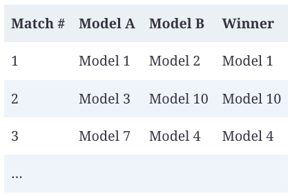
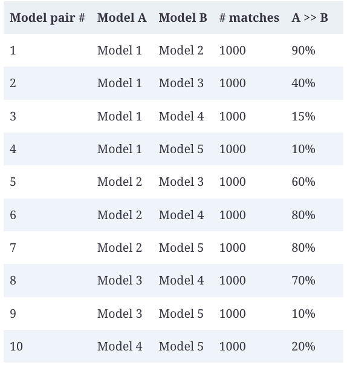

# Ranking Models with Comparative Evaluation

Often, you evaluate models not because you care about their scores, but because you want to know which model is the best for you. What you want is a ranking of these models. You can rank models using either pointwise evaluation or comparative  evaluation.

With pointwise evaluation, you evaluate each model independently,[22](https://learning.oreilly.com/library/view/ai-engineering/9781098166298/ch03.html#id965)  then rank them by their scores. For example, if you want to find out which dancer is the best, you evaluate each dancer individually, give them a score, then pick the dancer with the highest score.

With comparative evaluation, you evaluate models against each other and compute a ranking from comparison results. For the same dancing contest, you can ask all candidates to dance side-by-side and ask the judges which candidate’s dancing they like the most, and pick the dancer preferred by most judges.

For responses whose quality is subjective, comparative evaluation is typically easier to do than pointwise evaluation. For example, it’s easier to tell which song of the two songs is better than to give each song a concrete score.

In AI, comparative evaluation was first used in 2021 by  [Anthropic](https://arxiv.org/abs/2112.00861)  to rank different models. It also powers the popular LMSYS’s  [Chatbot Arena](https://oreil.ly/MHt5H)  leaderboard that ranks models using scores computed from pairwise model comparisons from the community.

Many model providers use comparative evaluation to evaluate their models in production.  [Figure 1](../images/chatgpt-evaluation-production.jpg)  shows an example of ChatGPT asking its users to compare two outputs side by side. These outputs could be generated by different models, or by the same model with different sampling variables.

###### Figure 1. ChatGPT occasionally asks users to compare two outputs side by side.

For each request, two or more models are selected to respond. An evaluator, which can be human or AI, picks the winner. Many developers allow for ties to avoid a winner being picked at random when drafts are equally good or bad.

A very important thing to keep in mind is that  _not all questions should be answered by preference_. Many questions should be answered by correctness instead. Imagine asking the model “Is there a link between cell phone radiation and brain tumors?” and the model presents two options, “Yes” and “No”, for you to choose from. Preference-based voting can lead to wrong signals that, if used to train your model, can result in misaligned behaviors.

Asking users to pick can also cause user frustration. Imagine asking the model a math question because you don’t know the answer, and the model gives you two different answers and asks you to pick the one you prefer. If you had known the right answer, you wouldn’t have asked the model in the first place.

When collecting comparative feedback from users, one challenge is to determine what questions can be determined by preference voting and what shouldn’t be. Preference-based voting only works if the voters are knowledgeable in the subject. This approach generally works in applications where AI serves as an intern or assistant, helping users speed up tasks they know how to do—and not where users ask AI to perform tasks they themselves don’t know how to do.

Comparative evaluation shouldn’t be confused with A/B testing. In A/B testing, a user sees the output from one candidate model at a time. In comparative evaluation, a user sees outputs from multiple models at the same time.

Each comparison is called a _match_. This process results in a series of comparisons, as shown in [Table 1](../images/history-pairwise.jpg).

###### Table 1. Examples of a history of pairwise model comparisons.

If there are only two models, ranking them is straightforward. The model that wins more often ranks higher. The more models there are, the more challenging ranking becomes. Let’s say that we have five models with the empirical win rates between model pairs, as shown in  [Table 2](../images/win-rates-of-five-models.jpg). It’s not obvious, from looking at the data, how these five models should be ranked.

###### Table 2. Example win rates of five models. The A >> B column denotes the event that A is preferred to B.

Given comparative signals, a  _rating algorithm_  is then used to compute a ranking of models. Typically, this algorithm first computes a score for each model from the comparative signals and then ranks models by their scores.

Comparative evaluation is new in AI but has been around for almost a century in other industries. It’s especially popular in sports and video games. Many rating algorithms developed for these other domains can be adapted to evaluating AI models, such as Elo, Bradley–Terry, and TrueSkill.  LMSYS’s Chatbot Arena originally used Elo to compute models’ ranking but later switched to the Bradley–Terry algorithm because they found Elo sensitive to the order of evaluators and prompts.[23](https://learning.oreilly.com/library/view/ai-engineering/9781098166298/ch03.html#id970)

_A ranking is correct if, for any model pair, the higher-ranked model is more likely to win in a match against the lower-ranked model_. If model A ranks higher than model B, users should prefer model A to model B more than half the time.

Through this lens, model ranking is a predictive problem. We compute a ranking from historical match outcomes and use it to predict future match outcomes. Different ranking algorithms can produce different rankings, and there’s no ground truth for what the correct ranking is. The quality of a ranking is determined by how good it is in predicting future match outcomes. My analysis of Chatbot Arena’s ranking shows that the produced ranking is good, at least for model pairs with sufficient matches. See the book’s  [GitHub repo](https://github.com/chiphuyen/aie-book)  for the analysis.