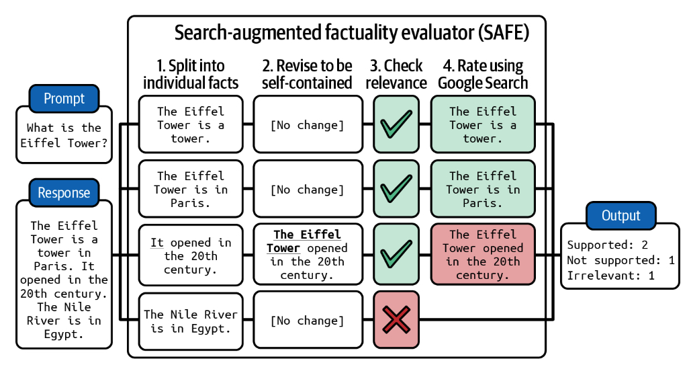

# Evaluation Criteria

Which is worse—an application that has never been deployed or an application that is deployed but no one knows whether it’s working? When I asked this question at conferences, most people said the latter. An application that is deployed but can’t be evaluated is worse. It costs to maintain, but if you want to take it down, it might cost even more.

AI applications with questionable returns on investment are, unfortunately, quite common. This happens not only because the application is hard to evaluate but also because application developers don’t have visibility into how their applications are being used. An ML engineer at a used car dealership told me that his team built a model to predict the value of a car based on the specs given by the owner. A year after the model was deployed, their users seemed to like the feature, but he had no idea if the model’s predictions were accurate. At the beginning of the ChatGPT fever, companies rushed to deploy customer support chatbots. Many of them are still unsure if these chatbots help or hurt their user experience.

Before investing time, money, and resources into building an application, it’s important to understand how this application will be evaluated. I call this approach  _evaluation-driven development_. The name is inspired by  [_test-driven development_](https://en.wikipedia.org/wiki/Test-driven_development)  in software engineering, which refers to the method of writing tests before writing code. In AI engineering, evaluation-driven development means defining evaluation criteria before building.

#### Evaluation-Driven Development

While some companies chase the latest hype, sensible business decisions are still being made based on returns on investment, not hype. Applications should demonstrate value to be deployed. As a result, the most common enterprise applications in production are those with clear evaluation criteria:

-   Recommender systems are common because their successes can be evaluated by an increase in engagement or purchase-through rates.[1](https://learning.oreilly.com/library/view/ai-engineering/9781098166298/ch04.html#id989)
    
-   The success of a fraud detection system can be measured by how much money is saved from prevented frauds.
    
-   Coding is a common generative AI use case because, unlike other generation tasks, generated code can be evaluated using functional correctness.
    
-   Even though foundation models are open-ended, many of their use cases are close-ended, such as intent classification, sentiment analysis, next-action prediction, etc. It’s much easier to evaluate classification tasks than open-ended tasks.
    

While the evaluation-driven development approach makes sense from a business perspective, focusing only on applications whose outcomes can be measured is similar to looking for the lost key under the lamppost (at night). It’s easier to do, but it doesn’t mean we’ll find the key. We might be missing out on many potentially game-changing applications because there is no easy way to evaluate them.

I believe that evaluation is the biggest bottleneck to AI adoption. Being able to build reliable evaluation pipelines will unlock many new applications.

An AI application, therefore, should start with a list of evaluation criteria specific to the application. In general, you can think of criteria in the following buckets: domain-specific capability, generation capability, instruction-following capability, and cost and latency.

Imagine you ask a model to summarize a legal contract. At a high level, domain-specific capability metrics tell you how good the model is at understanding legal contracts. Generation capability metrics measure how coherent or faithful the summary is. Instruction-following capability determines whether the summary is in the requested format, such as meeting your length constraints. Cost and latency metrics tell you how much this summary will cost you and how long you will have to wait for it.

The last chapter started with an evaluation approach and discussed what criteria a given approach can evaluate. This section takes a different angle: given a criterion, what approaches can you use to evaluate it?

## Domain-Specific Capability

To build a coding agent, you need a model that can write code. To build an application to translate from Latin to English, you need a model that understands both Latin and English. Coding and English–Latin understanding are domain-specific capabilities. A model’s domain-specific capabilities are constrained by its configuration (such as model architecture and size) and training data. If a model never saw Latin during its training process, it won’t be able to understand Latin. Models that don’t have the capabilities your application requires won’t work for you.

To evaluate whether a model has the necessary capabilities, you can rely on domain-specific benchmarks, either public or private. Thousands of public benchmarks have been introduced to evaluate seemingly endless capabilities, including code generation, code debugging, grade school math, science knowledge, common sense, reasoning, legal knowledge, tool use, game playing, etc. The list goes on.

Domain-specific capabilities are commonly evaluated using exact evaluation. Coding-related capabilities are typically evaluated using functional correctness, as discussed in  [Chapter 3](https://learning.oreilly.com/library/view/ai-engineering/9781098166298/ch03.html#ch03a_evaluation_methodology_1730150757064067). While functional correctness is important, it might not be the only aspect that you care about. You might also care about efficiency and cost. For example, would you want a car that runs but consumes an excessive amount of fuel? Similarly, if an SQL query generated by your text-to-SQL model is correct but takes too long or requires too much memory to run, it might not be usable.

Efficiency can be exactly evaluated by measuring runtime or memory usage.  [BIRD-SQL](https://oreil.ly/mOAjn)  (Li et al., 2023) is an example of a benchmark that takes into account not only the generated query’s execution accuracy but also its efficiency, which is measured by comparing the runtime of the generated query with the runtime of the ground truth SQL query.

You might also care about code readability. If the generated code runs but nobody can understand it, it will be challenging to maintain the code or incorporate it into a system. There’s no obvious way to evaluate code readability exactly, so you might have to rely on subjective evaluation, such as using AI judges.

Non-coding domain capabilities are often evaluated with close-ended tasks, such as multiple-choice questions. Close-ended outputs are easier to verify and reproduce. For example, if you want to evaluate a model’s ability to do math, an open-ended approach is to ask the model to generate the solution to a given problem. A close-ended approach is to give the model several options and let it pick the correct one. If the expected answer is option C and the model outputs option A, the model is wrong.

This is the approach that most public benchmarks follow. In April 2024, 75% of  the tasks  in Eleuther’s  [lm-evaluation-harness](https://github.com/EleutherAI/lm-evaluation-harness/blob/master/docs/task_table.md)  are multiple-choice, including  [UC Berkeley’s MMLU (2020)](https://arxiv.org/abs/2009.03300),  [Microsoft’s AGIEval (2023)](https://arxiv.org/abs/2304.06364), and the  [AI2 Reasoning Challenge (ARC-C) (2018)](https://oreil.ly/d3ggH). In their paper, AGIEval’s authors explained that they excluded open-ended tasks on purpose to avoid inconsistent assessment.

Here’s an example of a multiple-choice question in the MMLU benchmark:

-   Question: One of the reasons that the government discourages and regulates monopolies is that
    
    -   (A) Producer surplus is lost and consumer surplus is gained.
        
    -   (B) Monopoly prices ensure productive efficiency but cost society allocative efficiency.
        
    -   (C) Monopoly firms do not engage in significant research and development.
        
    -   (D) Consumer surplus is lost with higher prices and lower levels of output.
        
    -   Label: (D)
        

A multiple-choice question (MCQ) might have one or more correct answers. A common metric is accuracy—how many questions the model gets right. Some tasks use a point system to grade a model’s performance—harder questions are worth more points. You can also use a point system when there are multiple correct options. A model gets one point for each option it gets right.

Classification is a special case of multiple choice where the choices are the same for all questions. For example, for a tweet sentiment classification task, each question has the same three choices: NEGATIVE, POSITIVE, and NEUTRAL. Metrics for classification tasks, other than accuracy, include F1 scores, precision, and recall.

MCQs are popular because they are easy to create, verify, and evaluate against the random baseline. If each question has four options and only one correct option, the random baseline accuracy would be 25%. Scores above 25% typically, though not always, mean that the model is doing better than random.

A drawback of using MCQs is that a model’s performance on MCQs can vary with small changes in how the questions and the options are presented.  [Alzahrani et al. (2024)](https://arxiv.org/abs/2402.01781)  found that the introduction of an extra space between the question and answer or an addition of an additional instructional phrase, such as “Choices:” can cause the model to change its answers. Models’ sensitivity to prompts and prompt engineering best practices are discussed in  [Chapter 5](https://learning.oreilly.com/library/view/ai-engineering/9781098166298/ch05.html#ch05a_prompt_engineering_1730156991195551).

Despite the prevalence of close-ended benchmarks, it’s unclear if they are a good way to evaluate foundation models. MCQs test the ability to differentiate good responses from bad responses (classification), which is different from the ability to generate good responses. MCQs are best suited for evaluating knowledge (“does the model know that Paris is the capital of France?”) and reasoning (“can the model infer from a table of business expenses which department is spending the most?”). They aren’t ideal for evaluating generation capabilities such as summarization, translation, and essay writing. Let’s discuss how generation capabilities can be evaluated in the next section.

## Generation Capability

AI was used to generate open-ended outputs long before generative AI became a thing. For decades, the brightest minds in NLP (natural language processing) have been working on how to evaluate the quality of open-ended outputs. The subfield that studies open-ended text generation is called NLG (natural language generation). NLG tasks in the early 2010s included translation, summarization, and paraphrasing.

Metrics used to evaluate the quality of generated texts back then included  _fluency_  and  _coherence_. Fluency measures whether the text is grammatically correct and natural-sounding (does this sound like something written by a fluent speaker?). Coherence measures how well-structured the whole text is (does it follow a logical structure?). Each task might also have its own metrics. For example, a metric a translation task might use is  _faithfulness_: how faithful is the generated translation to the original sentence? A metric that a summarization task might use is  _relevance_: does the summary focus on the most important aspects of the source document? ([Li et al., 2022](https://arxiv.org/abs/2203.05227)).

Some early NLG metrics, including  _faithfulness_  and  _relevance_, have been repurposed, with significant modifications, to evaluate the outputs of foundation models. As generative models improved, many issues of early NLG systems went away, and the metrics used to track these issues became less important. In the 2010s, generated texts didn’t sound natural. They were typically full of grammatical errors and awkward sentences. Fluency and coherence, then, were important metrics to track. However, as language models’ generation capabilities have improved, AI-generated texts have become nearly indistinguishable from human-generated texts. Fluency and coherence become less important.[2](https://learning.oreilly.com/library/view/ai-engineering/9781098166298/ch04.html#id1001)  However, these metrics can still be useful for weaker models or for applications involving creative writing and low-resource languages. Fluency and coherence can be evaluated using AI as a judge—asking an AI model how fluent and coherent a text is—or using perplexity, as discussed in  [Chapter 3](https://learning.oreilly.com/library/view/ai-engineering/9781098166298/ch03.html#ch03a_evaluation_methodology_1730150757064067).

Generative models, with their new capabilities and new use cases, have new issues that require new metrics to track. The most pressing issue is undesired hallucinations. Hallucinations are desirable for creative tasks, not for tasks that depend on factuality. A metric that many application developers want to measure is  _factual consistency_. Another issue commonly tracked is safety: can the generated outputs cause harm to users and society? Safety is an umbrella term for all types of toxicity and biases.

There are many other measurements that an application developer might care about. For example, when I built my AI-powered writing assistant, I cared about  _controversiality_, which measures content that isn’t necessarily harmful but can cause heated debates. Some people might care about  _friendliness, positivity, creativity,_  or _conciseness_, but I won’t be able to go into them all. This section focuses on how to evaluate factual consistency and safety. Factual inconsistency can cause harm too, so it’s technically under safety. However, due to its scope, I put it in its own section. The techniques used to measure these qualities can give you a rough idea of how to evaluate other qualities you care about.

### Factual consistency

Due to factual inconsistency’s potential for catastrophic consequences, many techniques have been and will be developed to detect and measure it. It’s impossible to cover them all in one chapter, so I’ll go over only the broad strokes.

The factual consistency of a model’s output can be verified under two settings: against explicitly provided facts (context) or against open knowledge:

*Local factual consistency*

The output is evaluated against a context. The output is considered factually consistent if it’s supported by the given context. For example, if the model outputs “the sky is blue” and the given context says that the sky is purple, this output is considered factually inconsistent. Conversely, given this context, if the model outputs “the sky is purple”, this output is factually consistent.

Local factual consistency is important for tasks with limited scopes such as summarization (the summary should be consistent with the original document), customer support chatbots (the chatbot’s responses should be consistent with the company’s policies), and business analysis (the extracted insights should be consistent with the data).

*Global factual consistency*

The output is evaluated against open knowledge. If the model outputs “the sky is blue” and it’s a commonly accepted fact that the sky is blue, this statement is considered factually correct. Global factual consistency is important for tasks with broad scopes such as general chatbots, fact-checking, market research, etc.

Factual consistency is much easier to verify against explicit facts. For example, the factual consistency of the statement “there has been no proven link between vaccination and autism” is easier to verify if you’re provided with reliable sources that explicitly state whether there is a link between vaccination and autism.

If no context is given, you’ll have to first search for reliable sources, derive facts, and then validate the statement against these facts.

Often, the hardest part of factual consistency verification is determining what the facts are. Whether any of the following statements can be considered factual depends on what sources you trust: “Messi is the best soccer player in the world”, “climate change is one of the most pressing crises of our time”, “breakfast is the most important meal of the day”. The internet is flooded with misinformation: false marketing claims, statistics made up to advance political agendas, and sensational, biased social media posts. In addition, it’s easy to fall for the absence of evidence fallacy. One might take the statement “there’s no link between  _X_  and  _Y_” as factually correct because of a failure to find the evidence that supported the link.

One interesting research question is what evidence AI models find convincing, as the answer sheds light on how AI models process conflicting information and determine what the facts are. For example,  [Wan et al. (2024)](https://oreil.ly/hJucg)  found that existing “models rely heavily on the relevance of a website to the query, while largely ignoring stylistic features that humans find important such as whether a text contains scientific references or is written with a neutral tone.”

###### Tip

> When designing metrics to measure hallucinations, it’s important to analyze the model’s outputs to understand the types of queries that it is more likely to hallucinate on. Your benchmark should focus more on these queries.
>
>For example, in one of my projects, I found that the model I was working with tended to hallucinate on two types of queries:
>
>1.  Queries that involve niche knowledge. For example, it was more likely to hallucinate when I asked it about the VMO (Vietnamese Mathematical Olympiad) than the IMO (International Mathematical Olympiad), because the VMO is much less commonly referenced than the IMO.
> 
>2.  Queries asking for things that don’t exist. For example, if I ask the model “What did  _X_  say about  _Y_?” the model is more likely to hallucinate if  _X_  has never said anything about  _Y_  than if  _X_  has.

Let’s assume for now that you already have the context to evaluate an output against—this context was either provided by users or retrieved by you (context retrieval is discussed in [Chapter 6](https://learning.oreilly.com/library/view/ai-engineering/9781098166298/ch06.html#ch06_rag_and_agents_1730157386571386)). The most straightforward evaluation approach is AI as a judge. As discussed in [Chapter 3](https://learning.oreilly.com/library/view/ai-engineering/9781098166298/ch03.html#ch03a_evaluation_methodology_1730150757064067), AI judges can be asked to evaluate anything, including factual consistency. Both [Liu et al. (2023)](https://oreil.ly/HnIVp) and [Luo et al. (2023)](https://arxiv.org/abs/2303.15621) showed that GPT-3.5 and GPT-4 can outperform previous methods at measuring factual consistency. The paper [“TruthfulQA: Measuring How Models Mimic Human Falsehoods”](https://oreil.ly/xvYjL) (Lin et al., 2022) shows that their finetuned model GPT-judge is able to predict whether a statement is considered truthful by humans with 90–96% accuracy. Here’s the prompt that Liu et al. (2023) used to evaluate the factual consistency of a summary with respect to the original document:[3](https://learning.oreilly.com/library/view/ai-engineering/9781098166298/ch04.html#id1006)

    Factual Consistency: Does the summary untruthful or misleading facts that are 
    not supported by the source text?
    Source Text:
    {{Document}}
    Summary:
    {{Summary}}
    Does the summary contain factual inconsistency?
    Answer:

More sophisticated AI as a judge techniques to evaluate factual consistency are self-verification and knowledge-augmented verification:

*Self-verification*

SelfCheckGPT ([Manakul et al., 2023](https://arxiv.org/abs/2303.08896)) relies on an assumption that if a model generates multiple outputs that disagree with one another, the original output is likely hallucinated. Given a response R to evaluate, SelfCheckGPT generates N new responses and measures how consistent R is with respect to these N new responses. This approach works but can be prohibitively expensive, as it requires many AI queries to evaluate a response.

*Knowledge-augmented verification*

SAFE, Search-Augmented Factuality Evaluator, introduced by Google DeepMind (Wei et al., 2024) in the paper  [“Long-Form Factuality in Large Language Models”](https://arxiv.org/abs/2403.18802), works by leveraging search engine results to verify the response. It works in four steps, as visualized in  [Figure 1](../images/safe.jpg):

1.  Use an AI model to decompose the response into individual statements.
    
2.  Revise each statement to make it self-contained. For example, the “it” in the statement “It opened in the 20th century” should be changed to the original subject.
    
3.  For each statement, propose fact-checking queries to send to a Google Search API.
    
4.  Use AI to determine whether the statement is consistent with the research results.

###### Figure 1. SAFE breaks an output into individual facts and then uses a search engine to verify each fact. Image adapted from Wei et al. (2024).