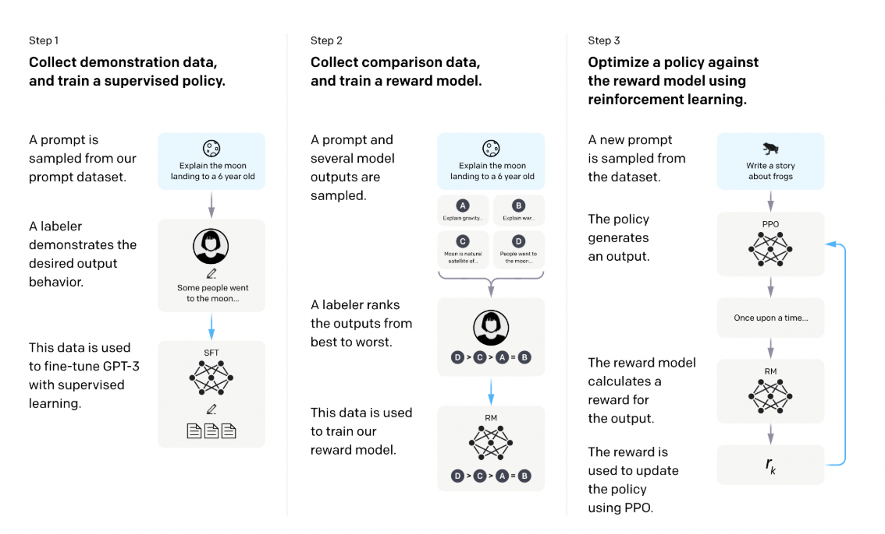

# Understanding Fine-Tuning

While pre-training gives large language models (LLMs) a general understanding of language, it falls short for instruction-following tasks. LLMs are trained to predict the next token in its training data (often web pages) and this doesn’t necessarily make it immediately capable of answering questions or following instructions. For example, if a user types in a regular Google search or a pre-trained LLM, like “In what country is Montreal?”, rather than generating an answer the LLM might instead generate lists of similar questions with similar meanings. Such a model would struggle to give good answers to requests like summarizing a web page or generating SQL queries. Fine-tuning is a method to address these limitations and specialize a model at understanding the format of user requests and the types of tasks it needs to perform.

Fine-tuning resumes training a pre-trained model to increase the performance of a specific task using task-specific data like question-answer pairs for general systems like ChatGPT or Claude. This allows the model to adjust its internal parameters and representations to better suit the task, thus improving its ability to tackle domain-specific issues.

**Instruction fine-tuning**  is a strategy popularized by OpenAI in 2022 with their  [InstructGPT models](https://arxiv.org/pdf/2203.02155.pdf). It gives LLMs the capacity to follow written human instructions and thus increases the level of control over the model’s outputs. The goal is to train an LLM to interpret prompts as instructions rather than just input for general text completion/generation.

However, standard fine-tuning for LLMs can be resource-heavy and expensive. It requires modifying all parameters in the pre-trained models, often in billions. Therefore, using more efficient and cost-effective fine-tuning techniques, such as Low-Rank Adaptation, is essential.

Several techniques are available to improve the performance of LLMs:

-   **Standard Fine-Tuning:**  It adjusts all the parameters in LLM to increase performance to a specific task. Although effective, it demands extensive computational resources, making it less valuable.
-   **Low-Rank Adaptation (LoRA):**  It modifies only a small subset of parameters by applying low-rank approximations on the lower layers of LLMs. This is a more efficient approach, significantly reducing the number of parameters that need training. LoRA reduces GPU memory requirements and lowers training costs.
-   **Supervised Fine-Tuning (SFT):**  It trains a base model on a new dataset under supervision. This new dataset typically includes demonstration data, prompts, and corresponding responses. The model learns from this data and generates responses that align with the expected outputs. SFT can be used for instruction fine-tuning.
-   **Reinforcement Learning from Human Feedback (RLHF):**  It iteratively trains models to align with human feedback. This approach can be more effective than SFT as it facilitates continuous improvement based on human input. Similar methodologies include Direct Preference Optimization (DPO) and Reinforcement Learning from AI Feedback (RLAIF).

# Low-Rank Adaptation (LoRA)

[Low-Rank Adaptation (LoRA)](https://arxiv.org/abs/2106.09685), developed by Microsoft researchers, enhances the LLM fine-tuning process. It addresses common fine-tuning challenges such as high memory requirements and computational inefficiency. LoRA introduces an efficient method involving  **low-rank matrices**  to store essential modifications in the model, avoiding altering all parameters.

LoRA has two very important features. First, it preserves the pre-trained weights of the model, preventing catastrophic forgetting and ensuring that valuable knowledge from pre-training is retained. Second, it employs efficient rank-decomposition, where smaller update matrices are added to the model’s existing weights. These matrices, requiring fewer parameters, focus training on the new weights, allowing for faster training with less memory usage. Typically, the LoRA matrices are integrated into the model’s attention layers.

LoRA’s approach to low-rank decomposition considerably lowers the memory requirements for training large language models. This reduction makes fine-tuning tasks accessible on consumer-grade GPUs, extending the advantages of LoRA to more researchers and developers.

Quantized Low-Rank Adaptation ([QLoRA](https://arxiv.org/abs/2305.14314)) is a more preferred variant of LoRA among developers that incorporates strategies to further conserve memory without compromising performance.

QLoRA backpropagates gradients through a frozen, 4-bit quantized pre-trained language model into Low-Rank Adapters, significantly cutting down memory usage. This allows for fine-tuning even larger models on standard GPUs. For example, QLoRA can fine-tune a language model with 65 billion parameters on a 48GB GPU, maintaining a comparable performance level as full 16-bit fine-tuning.

>💡Quantization is a powerful (and sometimes necessary) optimization technique that converts model weights from high-precision floating-point representation to low-precision floating-point or integers to reduce the model’s size and training compute requirements. We will talk about model optimization in more depth in the next chapter.

QLoRA uses a new data type called 4-bit NormalFloat (NF4), ideal for normally distributed weights. It also uses double quantization to lower the average memory footprint by quantizing the quantization constants and paged optimizers to manage memory spikes.

This efficiency is due to quantile quantization, a method well-suited for values with a normal distribution. It ensures that each bin in the quantization process contains equal values from the input tensor. This approach minimizes quantization error and leads to a more even data representation. Pre-trained neural network weights generally exhibit a zero-centered normal distribution with a particular standard deviation (σ). QLoRA standardizes these weights to a consistent fixed distribution by scaling σ. This scaling ensures that the distribution fits precisely within the NF4 data type’s range, thereby enhancing the efficiency and accuracy of the quantization process. This fine-tuning technique demonstrates no loss in accuracy in the authors’ experiments, matching the performance of BFloat16.

The  [Guanaco](https://huggingface.co/TheBloke/guanaco-65B-GPTQ)  models, which feature QLoRA fine-tuning, have shown cutting-edge performance even with smaller models. The versatility of QLoRA tuning makes it a popular choice for those looking to democratize the usage of big transformer models.

During the initial stages of neural network training, a 32-bit floating-point format was standard for training models, meaning each weight was represented by 32 bits and required 4 bytes of storage. To address this issue, the loading model now uses lower-precision numbers. Using an 8-bit format for numbers reduces storage requirements to a single byte.

With recent innovations, models can now be loaded in a 4-bit format, reducing memory requirements. The BitsAndBytes library loads pre-trained models even more memory-efficiently, as shown in the example code:

    from transformers import AutoModelForCausalLM, BitsAndBytesConfig  
    import torch  
      
    model = AutoModelForCausalLM.from_pretrained(  
    model_name_or_path='/name/or/path/to/your/model',  
    load_in_4bit=True,  
    device_map='auto',  
    torch_dtype=torch.bfloat16,  
    quantization_config=BitsAndBytesConfig(  
    load_in_4bit=True,  
    bnb_4bit_compute_dtype=torch.bfloat16,  
    bnb_4bit_use_double_quant=True,  
    bnb_4bit_quant_type='nf4'  
    ),  
    )

Note that this technique preserves model weights and does not impact the training process. Moreover, there’s a constant trade-off between using lower-precision numbers and potentially diminishing the language processing capabilities of models. While it’s generally acceptable in most cases, it’s important to acknowledge its presence.

### Tutorial 1: SFT with LoRA
### Tutorial 2: Using SFT and LoRA for Financial Sentiment
### Tutorial 3: Fine-Tuning a Cohere LLM with Medical Data

# Reinforcement Learning from Human Feedback

[Reinforcement Learning from Human Feedback](https://arxiv.org/abs/2305.18438) (RLHF)  is a technique introduced by OpenAI that combines human feedback with reinforcement learning to enhance the alignment and performance of LLMs. This method has been instrumental in improving the safety and utility of LLMs.

RLHF was first applied to  [InstructGPT](https://openai.com/research/instruction-following), a version of GPT-3 fine-tuned to follow instructions. Now, it is used in the latest OpenAI models, ChatGPT, and other state-of-the-art systems.

The process involves using human-curated preferences to guide the model toward preferred outputs, thus promoting the generation of responses that are more accurate, secure, and in line with human expectations. This is achieved using a reinforcement learning (RL) algorithm called Proximal Policy Optimization ([PPO](https://openai.com/research/openai-baselines-ppo)), which refines the LLM based on these human rankings. RLHF guides LLMs in generating appropriate texts by framing text generation as a reinforcement learning problem. In this setup, the language model acts as the RL agent, its potential language outputs constitute the action space, and the reward depends on the alignment of the LLM’s response with the application’s context and the user’s intent.

The RLHF process begins with training a large language model (LLM) on a vast text corpus from the internet. In some cases, the pre-trained LLM undergoes an optional fine-tuning step, where it is trained on a specialized dataset to help the subsequent reinforcement learning phase converge more quickly.

Next, the RLHF dataset is created by having the LLM generate multiple text completions for a series of instructions. Human evaluators then rank these completions based on factors like completeness, relevancy, accuracy, toxicity, and bias. These rankings are translated into scores, with higher scores representing better completions.

A reward model is then trained using this dataset, learning to score the completions in a way that mirrors human judgment. With this reward model in place, the LLM is fine-tuned using reinforcement learning. For each random instruction, the model generates a completion, which is then scored by the reward model. A reinforcement learning algorithm (PPO) uses these scores to adjust the LLM’s parameters, increasing the likelihood of higher-scoring completions. Throughout this process, a small Kullback-Leibler (KL) divergence is maintained between the fine-tuned and original LLM to preserve valuable information and ensure consistency. After several iterations, this results in a refined and improved LLM.

###### _Visual illustration of RLHF. From the “_[Open AI” blog.](https://openai.com/research/instruction-following)

It is possible to align LLMs to follow instructions with human values with SFT (with or without LoRA) with a high-quality dataset ([see the LIMA paper](https://arxiv.org/abs/2305.11206), “LIMA: Less Is More for Alignment”).

So, what’s the trade-off between RLHF and SFT? In reality, it’s still an open question. Empirically, RLHF can better align the LLM if the dataset is sufficiently large and high-quality. However, it’s more expensive and time-consuming. Additionally, reinforcement learning is still quite unstable, meaning that the results are very sensitive to the initial model parameters and training hyperparameters. It often falls into local optima, and the loss diverges multiple times, requiring multiple restarts. This makes it less straightforward than plain SFT.

## Alternatives to RLHF

[Direct Preference Optimization (DPO)](https://arxiv.org/pdf/2305.18290.pdf), an alternative to RLHF, is a relatively new method for fine-tuning language models.

Unlike RLHF, which requires complex reward functions and a delicate balance for effective text generation, DPO employs a more straightforward approach. It optimizes the language model directly using binary cross-entropy loss, avoiding the need for a separate reward model and the complexities of reinforcement learning-based optimization. This is achieved through an analytical conversion of the reward function into the optimal RL policy. The optimal RL policy transforms the RL loss, which typically incorporates the reward and reference models, into a loss over just the reference model.

As a result, DPO simplifies the fine-tuning process by removing the need for complicated RL approaches or a reward model.

Google DeepMind’s  [Reinforced Self-Training (ReST)](https://arxiv.org/abs/2308.08998)  offers another cost-effective alternative to RLHF. The ReST algorithm operates in a repetitive cycle of two main phases. In the first phase, called the “Grow” phase, the model generates various output predictions for each context, which are then used to expand the training dataset. The second phase, the “Improve” phase, involves ranking and filtering this expanded dataset using a reward model based on human preferences. The model is then fine-tuned using an offline reinforcement learning objective. The enhanced model feeds into the next Grow phase, continuing the cycle.

ReST has several advantages over RLHF. It reduces computational demands by reusing the output from the Grow phase across multiple Improve steps, avoiding the high costs of online reinforcement learning. Additionally, the quality of the policy is not constrained by the original dataset, as new training data is drawn from an improved policy during the Grow phase. The clear separation between the Grow and Improve phases allows for easier examination of data quality and the identification of alignment issues like reward hacking. Overall, ReST is a stable and straightforward approach, requiring minimal hyperparameter tuning.

[Reinforcement Learning from AI Feedback](https://arxiv.org/abs/2212.08073) (RLAIF), a concept developed by Anthropic, is another alternative to RLHF. RLAIF specifically aims to mitigate some of RLHF’s challenges, like subjectivity and limited scalability of human feedback.

RLAIF uses an AI Feedback Model for training feedback rather than relying on human input. This model operates under guidelines set by a human-created constitution, which outlines fundamental principles for the model’s evaluations. This method enables a more scalable supervision approach, moving away from the constraints of human preference-based feedback.

RLAIF generates a ranked preference dataset using the AI Feedback Model. This dataset is used to train a Reward Model similar to RLHF. The Reward Model subsequently acts as the reward indicator in a reinforcement learning framework for an LLM.

RLAIF is a viable option for fine-tuning safer and more efficient LLMs. It preserves the effectiveness of RLHF models while enhancing their safety, diminishes the influence of subjective human preferences, and offers greater scalability as a supervision method. On the downside, the feedback generated by the model is often of lower quality than human feedback.

A study conducted by Google demonstrated that RLAIF and RLHF are both preferred over standard SFT, with nearly identical favorability rates. This suggests that they could serve as feasible alternatives.

### Tutorial 4: Improving LLMs with RLHF